# Chapitre 6 : Monitoring et Production

## Objectif de ce chapitre

Mettre en place un système de monitoring complet pour une API LLM en production. Vous découvrirez comment instrumenter les métriques spécifiques aux LLM, tracer les coûts en temps réel, et configurer des alertes automatiques pour garantir la fiabilité et l'efficacité économique de votre système.

**Prérequis :**

- Architecture dédiée pour ce chapitre `FastAPI + LiteLLM + MLflow + Cache` opérationnelle
- Notions de base sur les systèmes distribués et l'observabilité
- Compréhension des concepts de caching du chapitre précédent

## Pourquoi le monitoring LLM est critique en production

### La complexité cachée des systèmes LLM distribués

Les systèmes LLM en production ne se comportent pas comme des applications traditionnelles. Chaque requête traverse potentiellement plusieurs couches de services : validation de sécurité, recherche dans le cache sémantique, routage vers différents providers, génération de contenu, logging, et tracking des coûts. Sans monitoring, cette complexité reste invisible et incontrôlable.

```mermaid
graph TB
    subgraph "Pipeline de Production LLM"
        CLIENT[Client HTTP<br/>Requêtes utilisateur]
        API[FastAPI Service<br/>Validation + Routing]
        SECURITY[Security Layer<br/>Prompt injection detection]
        CACHE[Cache Layer<br/>Qdrant + TEI embeddings]
        LLM_ROUTER[LLM Router<br/>Multi-provider routing]
        COST_TRACKER[Cost Tracker<br/>MLflow + Prometheus]
        ALERT_MANAGER[Alert Manager<br/>Slack + Email notifications]
        DASHBOARD[Monitoring Dashboard<br/>Grafana + Prometheus]
    end
    
    CLIENT --> API
    API --> SECURITY
    SECURITY --> CACHE
    CACHE --> LLM_ROUTER
    LLM_ROUTER --> COST_TRACKER
    COST_TRACKER --> ALERT_MANAGER
    ALERT_MANAGER --> DASHBOARD
    
    classDef service fill:#e3f2fd,stroke:#1976d2,stroke-width:2px
    classDef monitoring fill:#f3e5f5,stroke:#7b1fa2,stroke-width:2px
    
    class API,SECURITY,CACHE,LLM_ROUTER service
    class COST_TRACKER,ALERT_MANAGER,DASHBOARD monitoring
```

### Les trois piliers de l'observabilité LLM

L'observabilité moderne repose sur trois types de données complémentaires :

1. **Métriques** : Données numériques agrégées (latence, hit-rate, coût)
2. **Logs** : Événements textuels détaillés (requêtes, erreurs, décisions)
3. **Traces** : Chemin complet d'une requête à travers le système

Cette approche holistique permet de détecter les problèmes avant qu'ils n'affectent les utilisateurs et d'optimiser continuellement les performances.

## Démonstration pratique avec l'architecture de référence

### Lancement de l'environnement de monitoring

> Arrêter tous les conteneurs précédents et supprimez les images associées.

```sh
# Arrêt des conteneurs
docker-compose down

# Suppression (Attention cette commande supprime toutes les images)
docker rmi -f $(docker images -q)
```

> Maintenant, utiliser la commande `docker-compose` pour démarrer tous les conteneurs avec le monitoring intégré. Attention à bien utiliser les flags `--build` et `--force-recreate` pour forcer la reconstruction des images.

```sh
docker-compose up -d --build --force-recreate
```

> Vérifier que vous avez bien 7 conteneurs en tout dont 6 "vivants" (le 7ième ne servant qu'à tout bien initialiser).

```sh
docker-compose ps
```

L'architecture complète avec monitoring est la suivante :

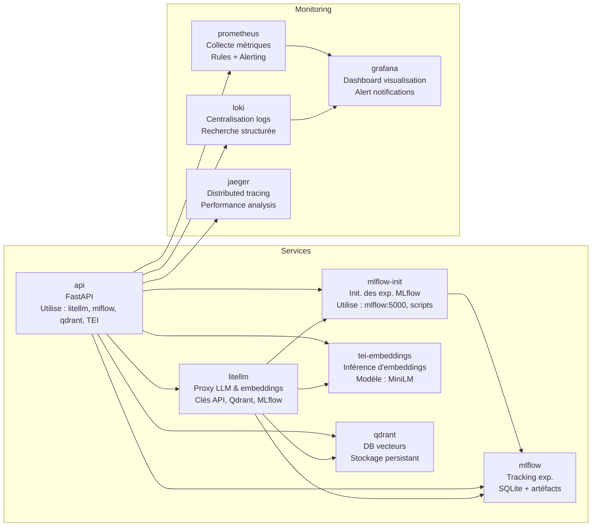

### Test 1 : Monitoring des métriques de base

Observons les métriques en temps réel avec les commandes disponibles dans le `Makefile.curl` de l'architecture de référence.

> Exécuter plusieurs requêtes pour générer des métriques :

```bash
# Générer du trafic pour les métriques
make -f Makefile.curl test-exact-cache
make -f Makefile.curl test-semantic-cache
make -f Makefile.curl test-security-validation
```

> Ouvrir un deuxième terminal et observer les métriques Prometheus :

```bash
# Observer les métriques en temps réel
curl -s http://localhost:9090/api/v1/query?query=llm_request_latency_seconds | jq
```

Vous devriez voir des métriques comme :

```json
{
  "status": "success",
  "data": {
    "resultType": "vector",
    "result": [
      {
        "metric": {
          "__name__": "llm_request_latency_seconds",
          "model": "groq-kimi-primary",
          "cache_hit": "true",
          "instance": "api:8000"
        },
        "value": [1700000000, "0.075"]
      }
    ]
  }
}
```

### Test 2 : Visualisation dans Grafana

> Accéder à l'interface Grafana via `http://localhost:3000`

> Importer le dashboard de monitoring LLM (ID: 18608) ou utiliser le dashboard pré-configuré

Les panels clés à observer :
- **Latence moyenne** : Comparaison entre cache hit et cache miss
- **Taux de cache hit** : Pourcentage de requêtes servies depuis le cache
- **Coût cumulé** : Tracking des dépenses API en temps réel
- **Erreurs et exceptions** : Monitoring de la qualité des réponses

## Métriques LLM spécifiques : l'instrumentation intelligente

### Latence et performance

La latence LLM est multifactorielle et nécessite une instrumentation fine pour identifier les goulots d'étranglement.

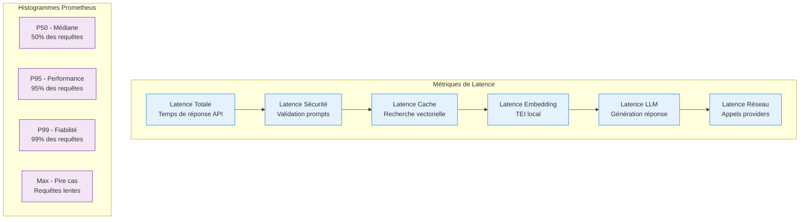

### Métriques économiques

Le tracking des coûts est essentiel pour optimiser l'utilisation des LLM en production.

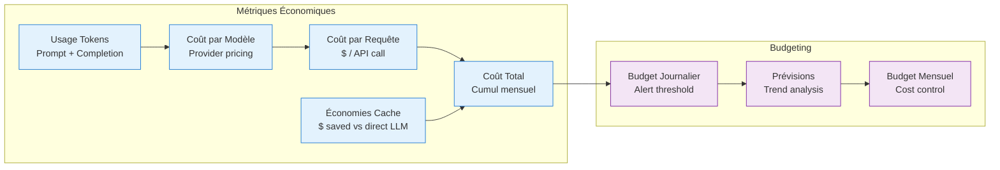

### Qualité des réponses

La qualité des réponses LLM nécessite des métriques spécifiques pour détecter les hallucinations et les dégradations.

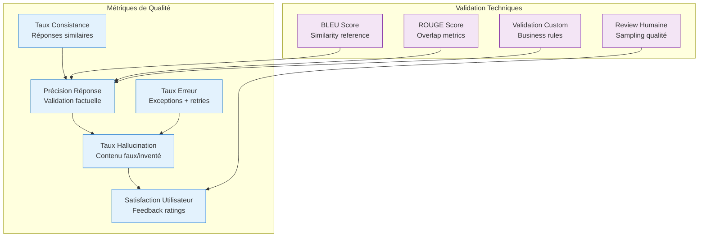

## Cost tracking et alerting : maîtriser les dépenses

### Architecture de cost tracking

Le système de cost tracking utilise MLflow pour enregistrer les coûts par requête et Prometheus pour l'agrégation en temps réel.

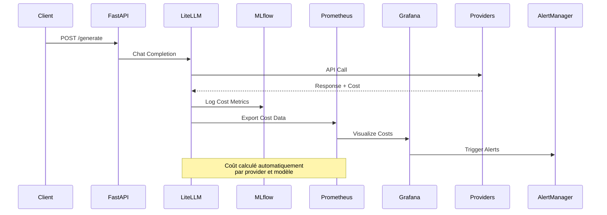

### Configuration des alertes de coût

Les alertes de coût permettent de prévenir les dépassements budgétaires avant qu'ils ne deviennent problématiques.

```yaml
# Fichier: prometheus/rules/cost_alerts.yml
groups:
- name: llm-cost-alerts
  rules:
  # Alert si coût horaire dépasse $10
  - alert: HighHourlyCost
    expr: sum(rate(llm_cost_total[1h])) > 10
    for: 5m
    labels:
      severity: warning
    annotations:
      summary: "Coût LLM élevé détecté"
      description: "Le coût horaire des requêtes LLM dépasse $10 ({{ $value }})"

  # Alert si budget mensuel dépasse 80%
  - alert: MonthlyBudgetWarning
    expr: llm_cost_monthly_total / llm_cost_monthly_budget * 100 > 80
    for: 1m
    labels:
      severity: warning
    annotations:
      summary: "Budget mensuel LLM à 80%"
      description: "Le budget mensuel est à {{ $value }}% de sa limite"

  # Alert critique si budget dépassé
  - alert: MonthlyBudgetExceeded
    expr: llm_cost_monthly_total > llm_cost_monthly_budget
    for: 1m
    labels:
      severity: critical
    annotations:
      summary: "Budget mensuel LLM dépassé"
      description: "Le budget mensuel de ${{ $labels.budget }} a été dépassé de ${{ $value }}"
```

### Notifications d'alertes

Les alertes peuvent être configurées pour envoyer des notifications via différents canaux.

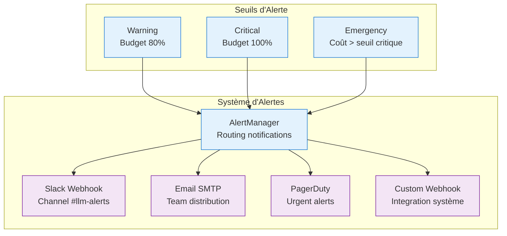

## Observabilité distribuée : tracer l'ensemble du pipeline

### Tracing avec OpenTelemetry

Le tracing distribué permet de suivre le chemin complet d'une requête à travers tous les services.

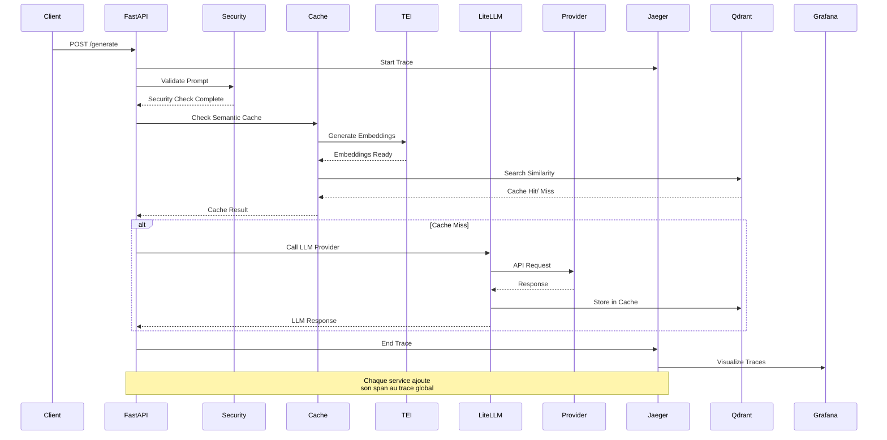

### Configuration du tracing

La configuration OpenTelemetry dans FastAPI permet de tracer automatiquement tous les appels.

```python
# Fichier: api/main.py - Configuration Tracing
from opentelemetry import trace
from opentelemetry.exporter.jaeger.thrift import JaegerExporter
from opentelemetry.sdk.trace import TracerProvider
from opentelemetry.sdk.trace.export import BatchSpanProcessor
from opentelemetry.instrumentation.fastapi import FastAPIInstrumentor

# Setup tracing
trace.set_tracer_provider(TracerProvider())
jaeger_exporter = JaegerExporter(
    agent_host_name="jaeger",
    agent_port=6831,
)
span_processor = BatchSpanProcessor(jaeger_exporter)
trace.get_tracer_provider().add_span_processor(span_processor)

# Instrument FastAPI
FastAPIInstrumentor.instrument_app(app)
```

### Logs structurés pour l'analyse

Les logs structurés permettent une analyse fine des comportements du système.

```python
# Fichier: api/logging_config.py
import logging
import json
from loguru import logger

class JSONFormatter(logging.Formatter):
    def format(self, record):
        log_entry = {
            "timestamp": self.formatTime(record),
            "level": record.levelname,
            "service": "fastapi-llm",
            "request_id": getattr(record, 'request_id', None),
            "cache_hit": getattr(record, 'cache_hit', False),
            "model": getattr(record, 'model', None),
            "latency": getattr(record, 'latency', 0),
            "cost": getattr(record, 'cost', 0),
            "message": record.getMessage()
        }
        return json.dumps(log_entry)

# Configuration des logs
logger.add("logs/llm.log", format=JSONFormatter(), rotation="500 MB")
```

## Implémentation pratique du monitoring

### Dashboard Grafana complet

Le dashboard Grafana expose toutes les métriques clés pour le monitoring LLM.

```mermaid
graph TB
    subgraph "Dashboard LLM Monitoring"
        LATENCY_PANEL[Latency Dashboard<br/>P50, P95, P99 metrics<br/>Cache hit vs miss comparison]
        COST_PANEL[Cost Tracking<br/>Real-time cost monitoring<br/>Budget alerts visualization]
        QUALITY_PANEL[Response Quality<br/>Accuracy metrics<br/>Hallucination detection]
        TRAFFIC_PANEL[Traffic Analysis<br/>Request volume<br/>Error rates]
    end
    
    subgraph "Alerting Integration"
        ALERT_RULES[Alert Rules<br/>Prometheus configuration<br/>Severity levels]
        NOTIFICATION_CHANNELS[Notification Channels<br/>Slack, Email, Webhook<br/>PagerDuty integration]
        ALERT_HISTORY[Alert History<br/>Past incidents<br/>Resolution tracking]
    end
    
    LATENCY_PANEL --> COST_PANEL
    COST_PANEL --> QUALITY_PANEL
    QUALITY_PANEL --> TRAFFIC_PANEL
    
    ALERT_RULES --> NOTIFICATION_CHANNELS
    NOTIFICATION_CHANNELS --> ALERT_HISTORY
    
    classDef dashboard fill:#e3f2fd,stroke:#1976d2
    classDef alerting fill:#f3e5f5,stroke:#7b1fa2
    
    class LATENCY_PANEL,COST_PANEL,QUALITY_PANEL,TRAFFIC_PANEL dashboard
    class ALERT_RULES,NOTIFICATION_CHANNELS,ALERT_HISTORY alerting
```

### Exemple de requête de monitoring

Voici comment interroger les métriques de monitoring pour l'analyse :

```bash
# Latence moyenne par modèle
curl -s "http://localhost:9090/api/v1/query?query=avg(llm_request_latency_seconds{model=~'groq.*'})" | jq

# Taux de cache hit
curl -s "http://localhost:9090/api/v1/query?query=rate(llm_cache_hits_total[5m]) / (rate(llm_cache_hits_total[5m]) + rate(llm_cache_misses_total[5m]))" | jq

# Coût total des requêtes
curl -s "http://localhost:9090/api/v1/query?query=sum(llm_cost_total)" | jq

# Logs d'erreurs
curl -s "http://localhost:3100/loki/api/v1/query?query={service='fastapi-llm'} |= 'ERROR'" | jq
```

## Gestion des incidents et fiabilité

### Circuit breaker pattern

Le circuit breaker protège le système contre les défaillances en cascade.

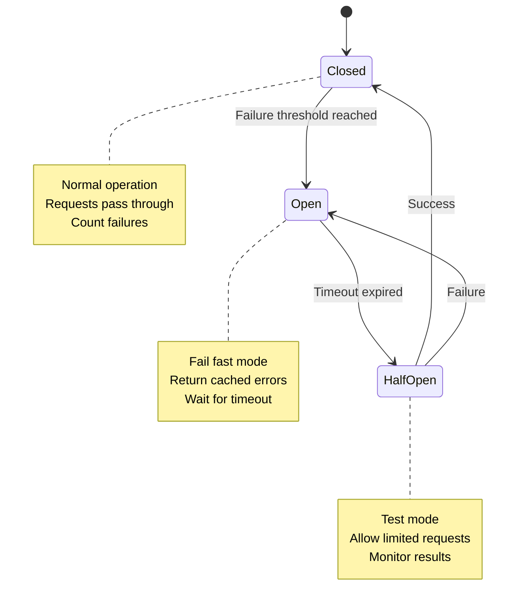

### Health checks et monitoring

Les health checks permettent de surveiller l'état de chaque service.

```bash
# Health check de l'API
curl -s http://localhost:8000/health | jq

# Health check du cache
curl -s http://localhost:6333/health | jq

# Health check des embeddings
curl -s http://localhost:80/health | jq

# Health check de MLflow
curl -s http://localhost:5000/health | jq
```

## Cas d'usage avancés et patterns de production

### Monitoring multi-région

Pour les déploiements globaux, le monitoring doit s'adapter à la distribution géographique.

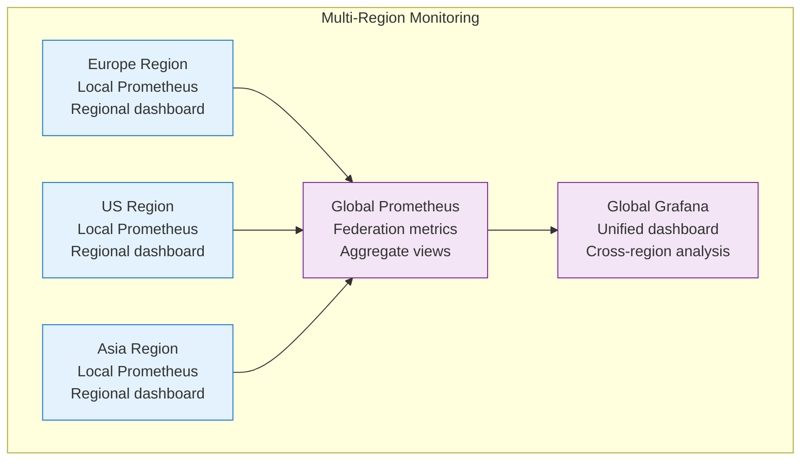

### Auto-scaling basé sur métriques

Le monitoring permet d'implémenter de l'auto-scaling intelligent basé sur la charge LLM.

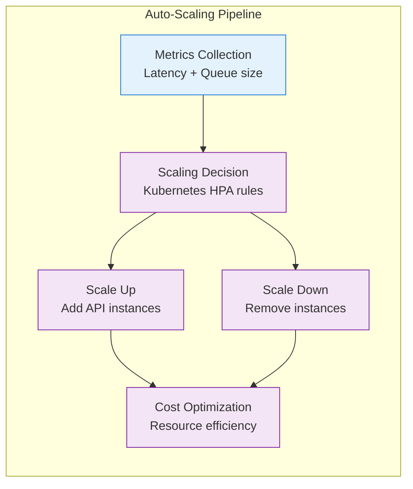

## Commandes de monitoring et maintenance

Pour le monitoring et la maintenance d'un système LLM en production, plusieurs commandes types sont disponibles :

```bash
# Vérifier l'état des services
docker-compose ps

# Observer les métriques Prometheus en temps réel
curl -s http://localhost:9090/api/v1/query?query=up | jq

# Analyser les logs avec Loki
curl -s "http://localhost:3100/loki/api/v1/query_range?query={job='fastapi'}&start=1h&end=now&step=10s" | jq

# Vérifier les traces dans Jaeger
curl -s http://localhost:16686/api/traces | jq

# Exporter le dashboard Grafana
curl -s http://localhost:3000/api/dashboards/uid/llm-monitoring | jq > llm_dashboard.json

# Tester les alertes
make -f Makefile.curl test-alerts
```

## Vérification des acquis

Vous maîtrisez maintenant l'architecture complète de monitoring pour un système LLM en production, depuis l'instrumentation des métriques spécifiques jusqu'à la configuration d'alertes automatiques et de tracing distribué.

Cette expertise permet de garantir la fiabilité, la performance, et l'efficacité économique des applications LLM en environnement de production.

### Question de réflexion

**Comment équilibrer la granularité du monitoring avec les coûts d'infrastructure, et quelles métriques sont indispensables pour un système LLM en production ?**

<details>

Le monitoring LLM nécessite un équilibre entre granularité et coûts infrastructure :

**Métriques indispensables :**
1. **Latence P95/P99** - Impact utilisateur direct
2. **Taux de cache hit** - Efficacité économique
3. **Coût cumulé** - Contrôle budgétaire
4. **Erreurs 5xx** - Fiabilité système
5. **Usage tokens** - Optimisation coûts

**Stratégies d'optimisation :**
- **Sampling intelligent** : Tracer 100% des erreurs, 10% des succès
- **Retention adaptée** : Métriques haute granularité (24h), logs (7j), traces (30j)
- **Federation Prometheus** : Un collecteur central avec des instances locales
- **Compression logs** : Utiliser Loki avec compression pour réduire le stockage

**ROI du monitoring :**
- Prévention des incidents coûteux (économies potentielles : $10k+/mois)
- Optimisation des coûts LLM (20-30% de réduction possible)
- Amélioration de l'expérience utilisateur (retention +15%)

</details>

## Synthèse : vers la production fiable

L'architecture de monitoring LLM révèle sa sophistication dans sa capacité à instrumenter intelligemment les métriques économiques, techniques, et qualitatives spécifiques aux modèles génératifs.

La progression du monitoring basique vers l'observabilité distribuée complète illustre l'évolution naturelle des systèmes LLM de production. Cette sophistication croissante répond à des besoins métier de plus en plus exigeants : fiabilité système, maîtrise budgétaire, qualité constante, et scalabilité internationale.

L'alerting et l'auto-healing constituent les piliers de la production fiable. Ces capacités transforment un système passif en plateforme proactive qui détecte et résout les problèmes avant qu'ils n'affectent les utilisateurs.

Une architecture complète FastAPI + LiteLLM + MLflow + Monitoring constitue une plateforme robuste capable de supporter des charges de production significatives tout en maintenant des coûts optimisés et une haute disponibilité.

Le chapitre suivant explorera l'orchestration de workflows complexes et l'intégration d'agents intelligents, construisant sur cette fondation de fiabilité pour créer des systèmes LLM véritablement autonomes et adaptatifs.
