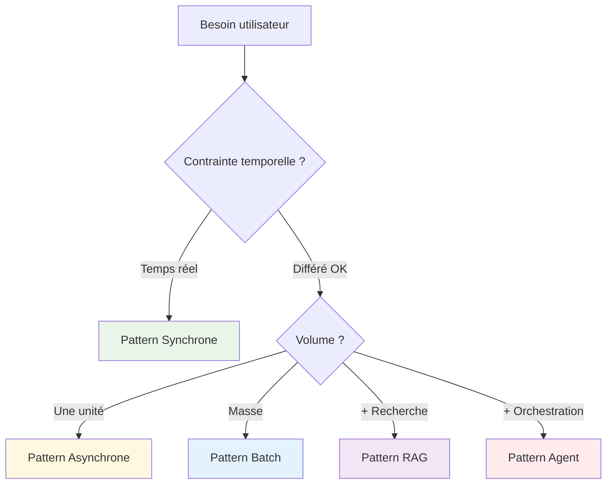
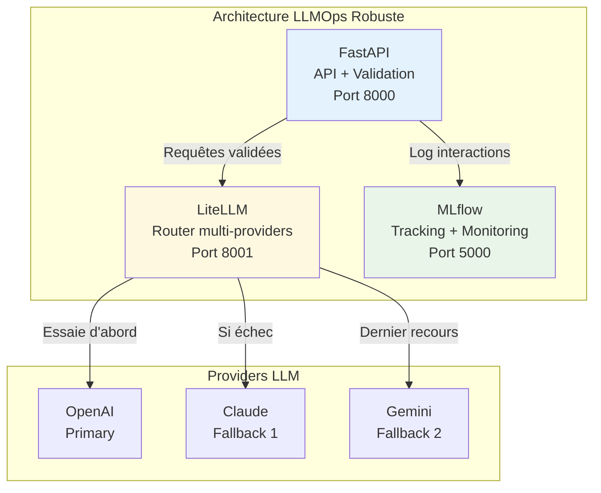
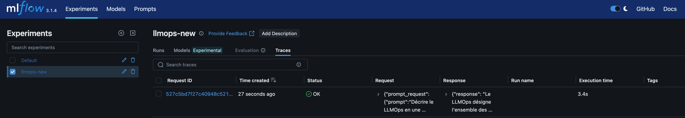
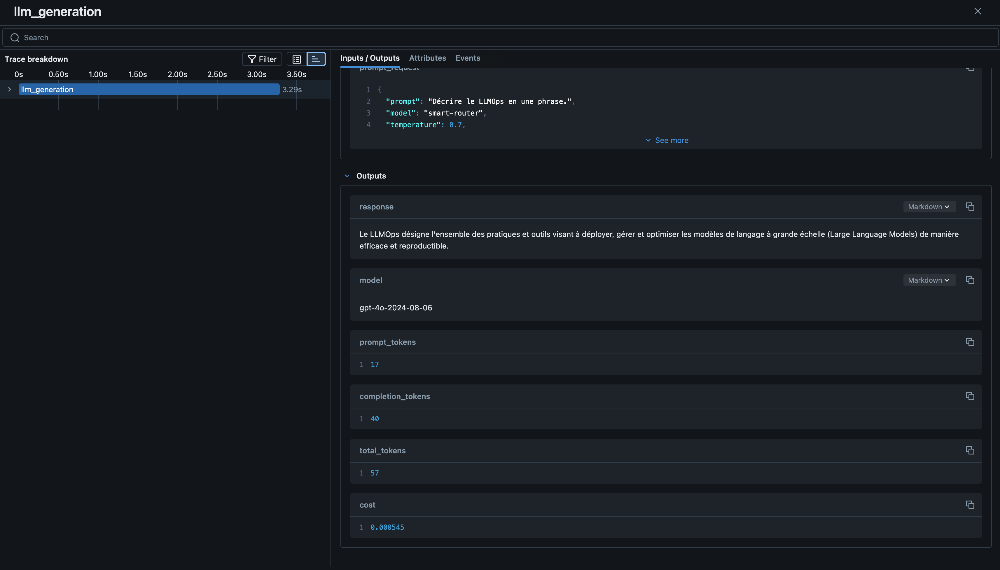

# Chapitre 1 : Introduction et Configuration

## Objectif de ce chapitre

À la fin de cette section, vous comprendrez pourquoi intégrer des LLM nécessite une approche différente du ML traditionnel. Vous identifierez les patterns d'architecture appropriés en partant de l'expérience concrète des limites de l'API OpenAI directe, puis découvrirez l'architecture qui résout ces défis.

**Prérequis :**

- Connaissance de base de Docker et docker-compose
- Familiarité avec les APIs REST
- Compréhension générale du ML

## LLM vs ML traditionnel : Un changement de paradigme

### L'analogie du cuisinier

Pour comprendre cette différence fondamentale, imaginez deux types de cuisiniers :

**Le cuisinier traditionnel (ML classique)** travaille comme un spécialiste dans une chaîne de restauration rapide. Il maîtrise parfaitement 5 recettes - burger, frites, salade, nuggets, boisson. Chaque burger est identique, préparé en 2 minutes exactement, avec le même goût à chaque fois. Économique, rapide, prédictible. Mais si vous lui demandez des sushis, il ne sait pas faire et doit retourner en formation pendant des semaines.

**Le cuisinier LLM** ressemble à un chef expérimenté qui a voyagé dans le monde entier. Il connaît les ingrédients, techniques et traditions culinaires de tous les pays. Vous pouvez lui demander n'importe quel plat - même inventé sur le moment - et il créera quelque chose de cohérent. Mais attention : même si vous commandez le même plat deux fois, le résultat sera légèrement différent à chaque fois. Et chaque création prend plus de temps et coûte plus cher en ingrédients.

Cette analogie révèle **la transformation architecturale majeure** : nous passons de la spécialisation prédictible vers la généralisation créative.


### Les trois défis incontournables

Cette différence d'approche introduit **trois défis techniques absents** du ML traditionnel :

**Défi 1 : Le non-déterminisme créatif**

Même avec des paramètres identiques, un LLM génère des réponses différentes à chaque appel. Ce n'est pas un bug, c'est une caractéristique. Imaginez un service client où la même question obtient des réponses variées mais cohérentes - comme un conseiller humain expérimenté qui reformule selon le contexte.

**Impact sur vos tests :** Impossible de vérifier `réponse == "Bonjour, puis-je vous aider ?"`. Vous devez tester des **propriétés qualitatives** : politesse présente, informations clés incluses, format JSON respecté.

**Défi 2 : L'économie à l'usage**

Chaque interaction coûte de l'argent - entre 0.001€ et 0.01€ par requête selon le modèle. 10 000 utilisateurs par jour représentent 50-500€ quotidiens. Contrairement au ML traditionnel où les prédictions deviennent "gratuites" après déploiement.

**Impact sur votre architecture :** Monitoring des coûts obligatoire, stratégies d'optimisation nécessaires.

**Défi 3 : La latence incompressible**

Un LLM prend 500ms à 5 secondes par réponse, contre 1-10ms pour un modèle ML classique. Cette latence transforme l'expérience utilisateur et l'architecture applicative.

**Impact sur votre interface :** Indicateurs de chargement obligatoires, patterns asynchrones nécessaires, gestion des timeouts.

## Première expérience : L'API OpenAI directe

### Démarrage avec l'exemple basique

Commençons par tester l'approche la plus directe pour comprendre concrètement ces enjeux. Le repository fourni contient un exemple simple du **Pattern 1 (Synchrone)** avec l'API OpenAI directe.

> Clôner [ce repository](https://github.com/DataScientest/LLMOps-setup-course.git) et créer un environnement virtuel avec `uv`.

%%SOLUTION%%

```bash
# Récupération du repository de formation
git clone <repo-url> llmops-training
cd llmops-training

# initialiser l'environnement avec UV
uv init

# synchroniser pour installer les librairies
uv sync
```

%%SOLUTION%%


> Créer un fichier `.env` en fonction du fichier `.env.template` et mettre à jour vos clés API. Vous pouvez ajouter votre API de OpenAI si vous avez un compte. Sinon, vous pouvez créer un compte sur l'un de ces sites qui proposent des clés API gratuite (Attention toutefois aux informations que vous partager):
>
> * https://console.groq.com/home
> * https://aistudio.google.com/apikey
> * https://openrouter.ai/settings/keys
>
> **Note:** Dans ce cours, nous allons utiliser `OpenAI` mais vous pouvez très facilement trouver les codes équivalent pour les autres fournisseurs.

```sh
# Configuration de votre clé API
cp .env.template .env
# Éditer .env avec votre clé OpenAI / vos clés
```

### Test de l'exemple Pattern 1

Le repository contient un exemple basique.

> Prenez un moment pour lire et exécuter le script `main.py` qui se trouve à la racine.

%%SOLUTION%%

```sh
# en utilisant uv
uv run main.py

# ou python main.py (après avoir activé l'environnement virtuel)
```

%%SOLUTION%%

Ci-dessous, ce qui s'affiche dans le terminal avec 2 exécution successives :

<details>
    <summary>Dérouler pour vous le détail</summary>

```bash
# Execution 1                 
Quantum computing is a type of computing that takes advantage of the strange and fascinating principles of quantum mechanics to process information in a fundamentally different way than traditional computers.

Here's a simplified explanation:

1. **Bits vs. Qubits**: Traditional computers use bits as the smallest unit of information, which can be either a 0 or a 1. Quantum computers use quantum bits, or qubits, which can be both 0 and 1 at the same time, thanks to a property called superposition.

2. **Superposition**: Imagine a spinning coin that is both heads and tails at the same time until you look at it. Similarly, a qubit can be in a state of 0, 1, or both at once until it's measured. This allows quantum computers to process a vast amount of possibilities simultaneously.

3. **Entanglement**: This is another key property where qubits can be linked together such that the state of one qubit can depend on the state of another, no matter the distance between them. This phenomenon allows for highly complex and coordinated processing tasks.

4. **Quantum Gates**: Like logic gates in classical computing, quantum gates manipulate qubits. However, they do so in ways that take advantage of superposition and entanglement, enabling the performance of complex calculations that would be infeasible for classical computers.

5. **Parallelism**: Because of superposition, a quantum computer can process many different inputs at once, potentially solving certain types of problems much faster than classical computers.

In summary, quantum computing leverages the unique properties of quantum mechanics to handle complex computations in ways that classical computers can't, which could revolutionize fields like cryptography, optimization, and materials science. However, building practical quantum computers is very challenging and still in the development stage.

# Execution 2

Quantum computing is a type of computing that uses the principles of quantum mechanics to process information. In classical computing, the basic unit of information is a bit, which can be either 0 or 1. However, in quantum computing, the basic unit is a quantum bit, or qubit, which can be 0, 1, or both at the same time, thanks to a property called superposition.

Another key principle of quantum computing is entanglement, which means that qubits can be linked together in such a way that the state of one qubit can depend on the state of another, no matter how far apart they are. This allows quantum computers to perform complex calculations much more quickly than classical computers for certain tasks.

Quantum computers have the potential to solve specific problems that are currently infeasible for classical computers, such as factoring large numbers, simulating quantum systems, and optimizing complex systems. However, quantum computing is still in the early stages of development, and there are significant technical challenges to overcome before it becomes widely practical.
```
</details>

**Testez plusieurs fois la même question** et observez :

- Les réponses sont-elles identiques ?
- Quelle est la latence moyenne ?
- L'API reste-t-elle disponible en permanence ?

On peut noter que 2 exécutions successives ne produisent pas du tout le même résultat (même si on conserve le fond).


### Les limites constatées rapidement

Après quelques tests, vous découvrirez les **problèmes concrets** de cette approche directe simplifiée :

**Problème 1 : Fragilité du service**

```bash
# Que se passe-t-il si OpenAI est en panne ?
# Votre application s'arrête complètement
```

**Problème 2 : Coûts invisibles**

Impossible de savoir :

- Combien vous dépensez par jour
- Quels endpoints coûtent le plus cher
- Comment optimiser la consommation

**Problème 3 : Monitoring inexistant**
Aucune visibilité sur :

- La latence moyenne de votre service
- Le taux de succès des appels
- La qualité des réponses générées

**Problème 4 : Gestion d'erreurs basique**
En cas d'échec, l'utilisateur voit une erreur technique plutôt qu'une dégradation gracieuse du service.

### Question de réflexion

**En production, votre service client repose sur cette API. OpenAI tombe en panne 30 minutes (cela est déjà arrivé). Quel est l'impact sur votre business et comment limitez-vous les dégâts ?**

> Sans architecture adaptée, votre service devient complètement indisponible. Vos clients ne peuvent plus être assistés, votre support est surchargé, et vous perdez potentiellement des ventes. Une architecture LLMOps robuste doit prévoir cette situation.

## Les patterns d'intégration : Solutions aux limites observées

### Pourquoi différents patterns ?

Les limites que vous venez de constater avec l'API directe ne sont pas spécifiques au pattern synchrone. Chaque contexte d'usage introduit des contraintes différentes qui nécessitent des architectures adaptées.

Pensez aux **différents modes de transport** selon votre trajet :

- Vélo pour 2km en ville (simple, direct)
- Voiture pour 50km avec bagages (flexible, état)
- Train pour 500km (optimisé volume)
- Avion pour 5000km (haute performance)

De même, l'intégration LLM suit **cinq patterns architecturaux** distincts :

| Pattern | Principe | Cas d'usage | Contrainte critique | Défis spécifiques |
|---------|----------|-------------|---------------------|-------------------|
| **1: Synchrone** | L'utilisateur attend la réponse en temps réel, comme un chat | • Chatbot de support client<br>• Assistant de rédaction en temps réel<br>• Traduction instantanée | Latence < 3 secondes (au-delà, l'utilisateur abandonne) | • Gestion des timeouts<br>• Fallback en cas de panne<br>• Optimisation de la latence |
| **2: Asynchrone** | Lancer une tâche, l'utilisateur récupère le résultat plus tard | • Analyse de document PDF de 50 pages<br>• Génération de rapport détaillé<br>• Résumé de réunion longue | Système de notification et suivi d'état | • Persistance de l'état des tâches<br>• Gestion des reprises après échec<br>• Interface de suivi pour l'utilisateur |
| **3: Batch** | Traiter des centaines d'éléments en une fois, optimiser les coûts | • Classification de 10 000 emails<br>• Extraction de données depuis 500 factures<br>• Génération de descriptions produits en masse | Gestion des échecs partiels | • Optimisation des coûts par groupement<br>• Monitoring de progression détaillé<br>• Reprise sur erreur partielle |
| **4: RAG** | Combiner recherche dans vos données + génération LLM. Réduire les hallucinations | • FAQ sur votre documentation<br>• Assistant technique spécialisé<br>• Analyse de contrats selon votre contexte | Pipeline de préparation des données | • Base de données vectorielle<br>• Équilibrage recherche/génération<br>• Mise à jour des connaissances |
| **5: Agent** | Le LLM décide quels outils utiliser pour résoudre une tâche complexe | • Assistant de développement (doc → code → test)<br>• Analyste financier (données → calculs → synthèse)<br>• Support technique (diagnostic → solution → doc) | Orchestration multi-services | • Gestion des boucles infinies<br>• Monitoring des décisions autonomes<br>• Coordination de services externes |

Ci-dessous, un guide simple et concrèt pour sélectionner le pattern de déploiement adapté suivant le besoin :



## Architecture de production : Résoudre les limites observées

### De l'API directe à une architecture plus robuste

Les problèmes identifiés avec l'utilisation de l'API directement nécessitent une architecture (pattern 1) qui adresse certaines faiblesses :



### Rôle de chaque composant dans la résolution

**FastAPI** résout le problème de **robustesse d'API** :

- Validation automatique des entrées (évite les erreurs de format)
- Documentation interactive intégrée
- Gestion d'erreurs standardisée avec messages utilisateur compréhensibles

**LiteLLM** (en mode proxy) est une bibliothèque open-source qui uniformise l'accès aux différents LLMs. Elle résout le problème de **fragilité du service** :

- Fallback automatique entre providers (OpenAI → Claude → Gemini)
- Retry intelligent avec backoff exponentiel
- Load balancing et optimisation des coûts

**MLflow** résout le problème de **monitoring inexistant** :

- Tracking de chaque interaction (prompt, réponse, latence, coût)
- Métriques agrégées pour détecter les dérives
- Interface web pour analyser les performances

### Démarrage de l'architecture synchrone simple

Exécuter les commandes ci-dessous :

```bash
# Passage à l'architecture robuste
docker-compose up -d --build

# Vérification que tous les services sont opérationnels
curl http://localhost:8000/health  # FastAPI
curl http://localhost:8001/health  # LiteLLM
curl http://localhost:5000         # MLflow
```

Votre stack est prête lorsque les trois endpoints répondent correctement.

### Test de l'amélioration

Maintenant, testez le même endpoint qu'avant :

```bash
curl -X POST http://localhost:8000/generate \
  -H "Content-Type: application/json" \
  -d '{"model": "smart-router", "prompt": "Décrire le LLMOps en une phrase."}'
```

On peut alors voir l'affichage ci-dessous sur l'interface de `mlflow` (http://localhost:5001/):



**Observez les améliorations :**

1. **Résilience** : Si OpenAI échoue, vous obtiendrez une réponse via le fallback
2. **Monitoring** : Consultez http://localhost:5000 pour voir l'interaction tracée
3. **Visibilité** : Latence, coût, provider utilisé sont maintenant visibles



### Exploration du monitoring MLflow

MLflow vous donne maintenant la visibilité qui manquait :

**Interface principale :** http://localhost:5000

- Historique de toutes les interactions
- Métriques par endpoint et par modèle
- Évolution des coûts dans le temps

**Informations trackées automatiquement :**

- Prompt complet envoyé au LLM
- Réponse générée
- Modèle/provider effectivement utilisé
- Latence de l'appel
- Nombre de tokens et coût estimé
- Timestamp pour analyse temporelle

**Analyses possibles :**

- Quel provider est le plus rapide/fiable ?
- Quels prompts génèrent les coûts les plus élevés ?
- Y a-t-il des patterns dans les échecs ?

## Vérification des acquis

Vous devriez maintenant pouvoir :

**Expliquer conceptuellement :**

- Pourquoi les LLM transforment l'architecture applicative (3 défis majeurs)
- Les limites concrètes de l'API directe et leurs impacts business
- Comment chaque composant de l'architecture résout un problème spécifique

**Identifier pratiquement :**

- Le pattern approprié selon les contraintes de votre cas d'usage
- Les métriques critiques à surveiller en production
- Les avantages du fallback automatique entre providers

**Utiliser techniquement :**

- L'environnement Docker multi-services fourni
- Les endpoints de test pour comparer avant/après
- L'interface MLflow pour analyser les interactions

### Test pratique de compréhension

> **Scénario :** Votre e-commerce veut analyser 5000 avis clients chaque nuit pour détecter les problèmes produits émergents et alerter les équipes par email avec un rapport détaillé.

**Questions :**
1. Quel pattern d'intégration choisir et pourquoi ?
2. Quelle métrique MLflow surveiller en priorité ?
3. Comment gérer les échecs partiels (50 avis non analysés sur 5000) ?

%%SOLUTION%%

**Réponses attendues :**

1. **Pattern Batch** : Volume important (5000), pas de contrainte temps réel, optimisation coûts par groupement
2. **Coût quotidien** et **taux de succès** : Pour contrôler le budget et détecter les dérives qualité
3. **Logging détaillé dans MLflow** des échecs + **reprise automatique** des items échoués

%%SOLUTION%%

## Synthèse

| Aspect | API Directe | Architecture LLMOps |
|--------|-------------|-------------------|
| **Complexité setup** | Simple | Modérée |
| **Résilience** | Fragile (single point failure) | Robuste (fallbacks) |
| **Visibilité** | Nulle | Monitoring complet |
| **Coûts** | Incontrôlés | Trackés et optimisables |
| **Évolutivité** | Limitée | Multi-patterns |
| **Production-ready** | Non | Oui |

**Points clés à retenir :**

L'intégration LLM démarre naturellement par l'API directe pour comprendre les concepts, mais révèle rapidement ses limites dès qu'on vise la production. Les patterns d'architecture ne sont pas des complications techniques mais des **réponses structurées aux problèmes réels** que vous avez expérimentés.

Chaque composant de votre stack (FastAPI, LiteLLM, MLflow) résout un défi spécifique identifié lors des tests initiaux. Cette progression **du simple vers le robuste** est la démarche naturelle en LLMOps.

**Transition vers le chapitre 2 :**

Maintenant que votre infrastructure est opérationnelle et que vous comprenez pourquoi elle est nécessaire, le chapitre suivant approfondira **l'art de la communication avec les LLM** : techniques de prompt engineering pour obtenir des réponses structurées fiables, validation robuste des sorties, et gestion des cas d'erreur.