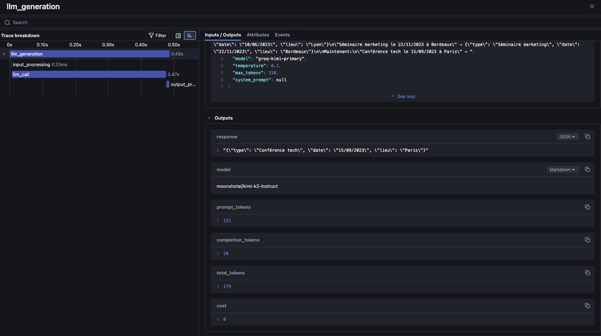

# Chapitre 2 : Prompt Engineering et Sorties Structurées

## Objectif de ce chapitre

Maîtriser les techniques essentielles pour obtenir des réponses fiables avec votre API LLM. Vous apprendrez à construire des prompts efficaces, choisir la bonne température, et garantir des sorties JSON valides.

**Prérequis :**

- Architecture du chapitre 1 fonctionnelle
- Endpoint `/generate` accessible sur http://localhost:8000

## Simple Prompt vs System Prompt

### Simple Prompt : Instructions directes

Le prompt simple donne une instruction directe au modèle. C'est le moyen par défaut d'interagor avec un modèle de langage.

> Aller sur la branche `chap2` et reconstruisez toute l'architecture.

%%SOLUTION%%

```sh
git checkout chap2
docker compose restart
```

%%SOLUTION%%

> Exécuter la commande suivant dans un terminal.

```bash
curl -X POST http://localhost:8000/generate \
  -H "Content-Type: application/json" \
  -d '{"model": "groq-kimi-primary", "prompt": "Décrire le LLMOps en une phrase."}'
```

On utiliser l'API de cette façon pour des **tâches ponctuelles, questions simples ou des traductions**.

> Tester l'API avec les prompts suivants :
>
> Prompt 1 : `Donne-moi des infos sur Paris`
> Prompt 1 : `Tu es un guide touristique expert.\nRÈGLES: Réponds en 3 points maximum, style professionnel.\nTÂCHE: Donne-moi des infos sur Paris`


Le simple prompt est à privilégier pour : Questions rapides, traductions, explications basiques. Cependant, maitriser le comportement du modèle peut s'avérer utile dans le cadre de la mise en place de certaines applications. On aura donc besoin d'utiliser des prompts systèmes.

### System Prompt : Définir un rôle

Le system prompt peut permette de **figer** le comportement du modèle. Avec des APIs utilisées en direct (comme celle de `openAi` ou même de `groq`) on doit ajouter à la commande `curl` le dictionnaire avec l'ensemble de clés-valeurs suivant: `{"role": "system", "content": <votre-prompt-system>}`. Nous avons déjà pris cela en compte dans le code de l'API `src/main.py` (voir la ligne `165`) via la mise en place d'un paramètre `"system_prompt": votre système prompt`.


> Exécuter la commande ci-dessous dans un terminal :

```bash
curl -X POST http://localhost:8000/generate \
  -H "Content-Type: application/json" \
  -d '{
    "model": "groq-kimi-primary", 
    "prompt": "Décrire le LLMOps en une phrase.",
    "system_prompt": "Tu es un expert en DevOps et MLOps. Réponds toujours de manière très technique et précise, en utilisant le jargon professionnel."
  }'
```

Qui donnera une sortie similaire à la sortie suivante :

```json
{
  "response": "LLMOps est la discipline MLOps spécialisée dans le pipeline complet de cycle de vie des grands modèles linguistiques, orchestrant l'entraînement distribué sur GPU/TPU, le registry de checkpoints versionnés, le fine-tuning PEFT/LoRA via pipelines CI/CD as-code, le déploiement sur clusters Kubernetes avec autoscaler GPU, le serving haute-débit via TensorRT-LLM ou vLLM, la surveillance des métriques de génération (perplexité, latency, TPS), la gestion des prompts et des embeddings dans des vectordb opérés, la garde-fou de sécurité",
  "model": "moonshotai/kimi-k2-instruct",
  "prompt_tokens": 57,
  "completion_tokens": 150,
  "total_tokens": 207,
  "cost": 0.0
}
```

> Maintenant, utiliser la même requête mais avec les système prompts suivants : 
> 
> system prompt 1 : `Tu es un professeur qui explique des concepts complexes à des étudiants débutants. Utilise un langage simple et des analogies.`
> system prompt 2 : `"Réponds toujours sous forme de liste à puces avec exactement 3 points. Chaque point doit commencer par un emoji."`

%%SOLUTION%%

Ci-dessous la commande utilisée et la sortie :

```sh
# 1
curl -X POST http://localhost:8000/generate \
  -H "Content-Type: application/json" \
  -d '{
    "model": "groq-kimi-primary", 
    "prompt": "Décrire le LLMOps en une phrase.",
    "system_prompt": "Tu es un professeur qui explique des concepts complexes à des étudiants débutants. Utilise un langage simple et des analogies."
  }'

# 2
curl -X POST http://localhost:8000/generate \
  -H "Content-Type: application/json" \
  -d '{
    "model": "groq-kimi-primary", 
    "prompt": "Quels sont les avantages du LLMOps ?",
    "system_prompt": "Réponds toujours sous forme de liste à puces avec exactement 3 points. Chaque point doit commencer par un emoji."
  }'
```

La sortie 1 :

```json
{
    "response":"Le LLMOps, c’est comme être le chef d’orchestre d’une IA générative : il prend le grand modèle de langage, l’accorde, l’entraîne, le déploie et le surveille en continu pour qu’il joue sa “symphonie” de textes sans fausse note.",
    "model":"moonshotai/kimi-k2-instruct",
    "prompt_tokens":55,
    "completion_tokens":78,
    "total_tokens":133,
    "cost":0.0
}
```

La sortie 2 :

```json
{
{
    "response":"- 🧪 Améliore la fiabilité et la
 cohérence des modèles linguistiques en production grâce à des pipelines de test systématiques et un suivi des dérives.  \n- 🚀 Accélère les cycles de mise à jour et réduit les coûts opérationnels via l’automatisation des déploiements, la gestion des ressources et l’optimisation des prompts.  \n- 🔍 Facilite la conformité réglementaire et l’auditabilité en tracant l’origine des données, les versions des modèles et les décisions générées.",
    "model":"moonshotai/kimi-k2-instruct",
    "prompt_tokens":52,
    "completion_tokens":143,
    "total_tokens":195,
    "cost":0.0}
}
```

%%SOLUTION%%

Vous pouvez voir que les réponses sont assez différentes et respectent les contraintes du prompt système. En termes de meilleurs pratiques, le prompt système doit se structurer de la manière suivante :


```txt
RÔLE: Tu es [rôle spécifique]
RÈGLES: 
- Règle 1
- Règle 2

TÂCHE: [instruction spécifique]
```

**Cas d'usage du prompt système:**

* Définir un rôle : `Tu es un expert en...`, `Tu es un professeur...`
* Contrôler le format : `Réponds en liste`, `Utilise des emojis`
* Ajuster le ton : `Sois technique`, `Sois simple`
* Contraindre la longueur : `Réponds en une phrase`, `Donne 3 points`

Vu qu'on utilise toujours la mini architecture détaillée au chapitre 1, on conserve le tracking MLflow :

* Le system prompt est automatiquement tracé dans MLflow
* Attributs ajoutés : `request.system_prompt`, `request.has_system_prompt`


## Choisir la température : Guide simple

La température est un paramètre des modèles qui permet de contrôler la "créativité" du modèle :

| Température | Usage | Exemple |
|-------------|-------|---------|
| **0.0 - 0.2** | Extraction de données, JSON | `"temperature": 0.1` |
| **0.3 - 0.5** | Classification, résumés | `"temperature": 0.4` |
| **0.6 - 0.8** | Contenu créatif, descriptions | `"temperature": 0.7` |
| **0.9 - 1.0** | Brainstorming, fiction | `"temperature": 0.9` |

### Tests de température

Testez le même prompt avec différentes températures :

```bash
# Température basse - Factuel
curl -X POST http://localhost:8000/generate \
  -H "Content-Type: application/json" \
  -d '{"model": "groq-kimi-primary", "prompt": "Décris Python en une phrase", "temperature": 0.2}'

# Température haute - Créatif
curl -X POST http://localhost:8000/generate \
  -H "Content-Type: application/json" \
  -d '{"model": "groq-kimi-primary", "prompt": "Décris Python en une phrase", "temperature": 0.9}'
```

> Exécutez chaque commande plusieurs fois et observez la variabilité.

## Few-Shot Learning : Apprendre par l'exemple

### Le principe

La technique du `Few-Shot` permet de montrer des exemples avant la vraie tâche. Cela permet d'améliorer drastiquement la qualité des réponses:

> Exécuter les commandes ci-dessous :

```bash
# ❌ Sans exemple (zero-shot)
curl -X POST http://localhost:8000/generate \
  -H "Content-Type: application/json" \
  -d '{"model": "groq-kimi-primary", "prompt": "Ce produit est décevant"}'

# ✅ Avec exemples (few-shot - la température est importante dans cet exemple)
curl -X POST http://localhost:8000/generate \
  -H "Content-Type: application/json" \
  -d '{
    "model": "groq-kimi-primary", 
    "prompt": "Classe le sentiment (positif/neutre/négatif):\n\nExemples:\n\"J'\''adore ce service\" → positif\n\"C'\''est correct\" → neutre\n\"Très déçu\" → négatif\n\nMaintenant:\n\"Ce produit est décevant\"", 
    "temperature": 0.2
  }'
```

Pour une meilleure structure de vos prompts en incluant dans exemples, vous pouvez utiliser le format ci-dessous :

```txt
TÂCHE: [Description de la tâche]

EXEMPLES:
"[Exemple 1]" → [Résultat 1]
"[Exemple 2]" → [Résultat 2]
"[Exemple 3]" → [Résultat 3]

MAINTENANT:
"[Nouvelle entrée]" → 
```

> **Exercice**: Créez un prompt pour extraire automatiquement le nom et l'email d'un texte.
> 
> 1. Votre prompt doit utiliser la technique du few-shot learning avec au moins 2 exemples
> 2. Il doit clairement indiquer la tâche à accomplir
> 3. Formatez la sortie pour qu'elle soit cohérente (Nom: xxx, Email: xxx)
> 4. Testez avec l'entrée: "Appelez Sarah Chen sur sarah.chen@startup.io"
> 
> Utilisez une température basse (0.1) pour garantir une extraction précise.

%%SOLUTION%%

```bash
curl -X POST http://localhost:8000/generate \
  -H "Content-Type: application/json" \
  -d '{
    "model": "groq-kimi-primary",
    "prompt": "Extrais le nom et email:\n\nExemples:\n\"Contactez Marie Dubois à marie@test.fr\" → Nom: Marie Dubois, Email: marie@test.fr\n\"Paul Martin: paul@demo.com\" → Nom: Paul Martin, Email: paul@demo.com\n\nMaintenant:\n\"Appelez Sarah Chen sur sarah.chen@startup.io\" → ",
    "temperature": 0.1
  }'
```

%%SOLUTION%%

## Garantir des sorties JSON

### Le problème

Les LLM peuvent retourner des formats variés, mais pour des applications en production, nous avons besoin d'une structure JSON cohérente et valide :

- `{"nom": "Jean"}` ✅ - JSON valide
- `Voici le résultat: {"nom": "Jean"}` ❌ - Texte supplémentaire qui casse le parsing
- `{nom: "Jean"}` ❌ - JSON invalide (clés sans guillemets)

Pour obtenir systématiquement du JSON valide, voici trois techniques efficaces :

### Technique 1 : Instructions explicites

Commencez par des instructions claires et sans ambiguïté :

```bash
curl -X POST http://localhost:8000/generate \
  -H "Content-Type: application/json" \
  -d '{
    "model": "groq-kimi-primary",
    "prompt": "IMPORTANT: Réponds UNIQUEMENT avec du JSON valide, aucun autre texte.\n\nExtrais les infos:\n\"Marie Dupont, 30 ans, développeuse\"\n\nFormat: {\"nom\": \"...\", \"age\": ..., \"metier\": \"...\"}",
    "temperature": 0.1
  }' | jq -r '.response' | jq .
```

Cette technique fonctionne bien mais n'est pas infaillible, car le modèle peut parfois ignorer les instructions.

### Technique 2 : Amorcer la réponse

En commençant la structure JSON dans le prompt, vous forcez le modèle à continuer dans ce format :

```bash
curl -X POST http://localhost:8000/generate \
  -H "Content-Type: application/json" \
  -d '{
    "model": "groq-kimi-primary",
    "prompt": "Extrais les données de \"Jean Martin, designer\".\n\nRéponds avec ce JSON:\n{\n  \"nom\": \"",
    "temperature": 0.1
  }' | jq -r '.response' | jq .
```

Cette méthode est très efficace car le modèle tend naturellement à compléter la structure commencée.

### Technique 3 : Few-shot JSON

Les exemples concrets montrent au modèle exactement ce que vous attendez :

```bash
curl -X POST http://localhost:8000/generate \
  -H "Content-Type: application/json" \
  -d '{
    "model": "groq-kimi-primary",
    "prompt": "Extrais au format JSON:\n\nExemples:\n\"Paul, 25 ans\" → {\"nom\": \"Paul\", \"age\": 25}\n\"Marie, designer\" → {\"nom\": \"Marie\", \"metier\": \"designer\"}\n\nMaintenant:\n\"Luc, 30 ans, développeur\" → ",
    "temperature": 0.1
  }' | jq -r '.response' | jq .
```

Cette approche combine démonstration et contexte, ce qui la rend particulièrement robuste pour obtenir des formats cohérents.

> Créez un prompt utilisant le pattern d'extraction de données pour extraire les informations d'un événement.
> 
> 1. Utilisez la technique du few-shot learning avec 2 exemples
> 2. Extrayez la date, le lieu et le type d'événement
> 3. Formatez la sortie en JSON valide
> 4. Testez avec l'entrée: "Conférence tech le 15/09/2023 à Paris"
> 

%%SOLUTION%%

```bash
curl -X POST http://localhost:8000/generate \
  -H "Content-Type: application/json" \
  -d '{
    "model": "groq-kimi-primary",
    "prompt": "Extrais les informations d'\''événement au format JSON:\n\nExemples:\n\"Concert le 10/06/2023 à Lyon\" → {\"type\": \"Concert\", \"date\": \"10/06/2023\", \"lieu\": \"Lyon\"}\n\"Séminaire marketing le 22/11/2023 à Bordeaux\" → {\"type\": \"Séminaire marketing\", \"date\": \"22/11/2023\", \"lieu\": \"Bordeaux\"}\n\nMaintenant:\n\"Conférence tech le 15/09/2023 à Paris\" → ",
    "temperature": 0.1
  }' | jq -r '.response' | jq .
```

%%SOLUTION%%

> Combien de tokens ont été consommé en tout pour cette requête ?

%%SOLUTION%%

Il vous suffit de regarder sur `Mlflow`



%%SOLUTION%%

## Patterns de prompts par cas d'usage

Voici les patterns courants pour différents cas d'usage, avec des exemples concrets pour chacun.

### 1. Extraction de données

L'extraction de données consiste à identifier et isoler des informations spécifiques d'un texte. Une température basse (0.1) garantit des résultats cohérents et prévisibles.

```bash
curl -X POST http://localhost:8000/generate \
  -H "Content-Type: application/json" \
  -d '{
    "model": "groq-kimi-primary",
    "prompt": "Tu es un extracteur de données.\nRÈGLE: JSON uniquement.\n\nExemples:\n\"Facture N°123, Client: ABC Corp\" → {\"numero\": \"123\", \"client\": \"ABC Corp\"}\n\nMaintenant:\n\"Commande #456, Produit: Laptop\" → ",
    "temperature": 0.1
  }'
```

### 2. Classification

Pour la classification, on utilise généralement une température légèrement plus élevée (0.2) pour permettre une certaine flexibilité dans les catégories, tout en maintenant la cohérence.

```bash
curl -X POST http://localhost:8000/generate \
  -H "Content-Type: application/json" \
  -d '{
    "model": "groq-kimi-primary",
    "prompt": "Classe en urgent/normal/bas:\n\nExemples:\n\"Bug critique en production\" → urgent\n\"Mise à jour documentation\" → bas\n\"Nouvelle fonctionnalité\" → normal\n\nMaintenant:\n\"Serveur inaccessible\" → ",
    "temperature": 0.2
  }'
```

### 3. Validation

La validation nécessite des réponses binaires précises, d'où l'utilisation d'une température très basse (0.1) pour éviter toute ambiguïté.

```bash
curl -X POST http://localhost:8000/generate \
  -H "Content-Type: application/json" \
  -d '{
    "model": "groq-kimi-primary",
    "prompt": "Vérifie si l'\''email est valide (oui/non):\n\nExemples:\n\"jean@test.com\" → oui\n\"email-invalide\" → non\n\"marie@\" → non\n\nMaintenant:\n\"paul.martin@entreprise.fr\" → ",
    "temperature": 0.1
  }'
```

## Vérification dans MLflow

Après vos tests, consultez MLflow sur http://localhost:5001 pour voir :

1. **Coût par prompt** : Few-shot vs simple
2. **Latence** : Impact de la longueur du prompt
3. **Cohérence** : Même prompt = même résultat ?


## Automatisation

Nous avons jusque là utilisé des requêtes `curl` mais dans la pratique, on va vouloir automatiser les tâches en utilisant des scripts avec Python.


> 1. Écrivez un script Python dans `src/extract_contact_info.py` qui:
>
>    - Utilise l'API locale
>    - Extrait nom, email et numéro de téléphone d'un texte
>    - Utilise un system prompt définissant le rôle d'extracteur de données
>    - Inclut 2-3 exemples few-shot
>    - Configure la température à une valeur optimale pour l'extraction
> 
> 2. Testez avec l'entrée: `Contactez notre chef de projet Marc Dubois au 06-12-34-56-78 ou marc.dubois@entreprise.com`.
>
> Voici la réponse attendue :

```sh
Texte d'entrée: Contactez notre chef de projet Marc Dubois au 06-12-34-56-78 ou marc.dubois@entreprise.com

Résultat de l'extraction:
{
  "nom": "Marc Dubois",
  "email": "marc.dubois@entreprise.com",
  "telephone": "06-12-34-56-78"
}
```

%%SOLUTION%%

```python
# src/extract_contact_info_correction.py
import requests
import json

def extract_contact_info(text):
    """Extract contact information using the local LLM API."""
    
    url = "http://localhost:8000/generate"
    
    # Define system prompt for role specification
    system_prompt = "Tu es un assistant spécialisé dans l'extraction précise de données. Extrais uniquement les informations demandées au format JSON spécifié. Ne fais aucun commentaire."
    
    # Create few-shot examples in the prompt
    prompt = f"""Extrais le nom, l'email et le numéro de téléphone du texte suivant et retourne-les au format JSON.

Exemples:
"Veuillez contacter Jean Martin à jean.martin@example.com ou au 01-23-45-67-89" → {{"nom": "Jean Martin", "email": "jean.martin@example.com", "telephone": "01-23-45-67-89"}}
"Pour plus d'informations: Sophie Durand (sophie@company.fr, 07-11-22-33-44)" → {{"nom": "Sophie Durand", "email": "sophie@company.fr", "telephone": "07-11-22-33-44"}}
"Notre représentant Pierre Blanc (p.blanc@corp.com) est joignable au 06-99-88-77-66" → {{"nom": "Pierre Blanc", "email": "p.blanc@corp.com", "telephone": "06-99-88-77-66"}}

Maintenant:
"{text}" → """
    
    # Set parameters - low temperature for deterministic extraction
    payload = {
        "prompt": prompt,
        "system_prompt": system_prompt,
        "model": "groq-kimi-primary",
        "temperature": 0.1,  # Low temperature for consistent data extraction
        "max_tokens": 150
    }
    
    # Make the API call
    response = requests.post(url, json=payload)
    response_data = response.json()
    
    # Parse the response string as JSON
    try:
        extracted_info = json.loads(response_data['response'])
        return extracted_info
    except json.JSONDecodeError:
        # Return a structured error if parsing fails
        return {"error": "Failed to parse response as JSON", "raw_response": response_data['response']}

if __name__ == "__main__":
    # Test with example text
    test_text = "Contactez notre chef de projet Marc Dubois au 06-12-34-56-78 ou marc.dubois@entreprise.com"
    result = extract_contact_info(test_text)
    
    print("Texte d'entrée:", test_text)
    print("\nRésultat de l'extraction:")
    print(json.dumps(result, indent=2))
    
    # Expected output:
    # {"nom": "Marc Dubois", "email": "marc.dubois@entreprise.com", "telephone": "06-12-34-56-78"}
```

Exécutez ce script pour voir comment notre API extrait automatiquement les coordonnées avec une grande précision grâce à la combinaison:

- System prompt définissant clairement le rôle
- Exemples few-shot pour guider le format
- Température basse (0.1) pour l'extraction de données fiable

🚨🚨🚨 **Remarques :** Pour des questions de RGPD, il ne faudra JAMAIS envoyer un prompt similaire avec de VRAIES informations.

%%SOLUTION%%


## Structured Output avec JSON Schema

### Pourquoi utiliser le Structured Output ?

Le **structured output** (sortie structurée) est une fonctionnalité cruciale pour les applications LLMOps en production. Voici pourquoi :

#### 🎯 **Problèmes résolus vs Avantages du Structured Output**

| Problème | Solution avec Structured Output |
|---------|--------------------------------|
| **Inconsistance des formats** | **Garantie de format** : JSON toujours valide et conforme au schema |
| **Parsing complexe** | **Intégration facile** : Parsing direct en objets Python/JSON |
| **Gestion d'erreurs** | **Validation automatique** : Champs requis garantis présents |
| **Maintenance** | **Prompts simplifiés** : Plus besoin d'exemples complexes |
| - | **Robustesse** : Moins d'erreurs de parsing en production |

### Implémentation avec LiteLLM

Notre API supporte le structured output via le paramètre `response_format` avec JSON Schema. La mise en place de la sortie structurée passe par la définition d'un schéma JSON de sortie à insérer dans la donnée envoyée au modèle.

#### **Format de requête**

```json
{
  "prompt": "Votre instruction",
  "model": "groq-kimi-primary",
  "system_prompt": "Rôle de l'assistant", # Début définition du schéma de sortie
  "response_format": {
    "type": "json_schema",
    "json_schema": {
      "name": "nom_du_schema",
      "schema": {
        "type": "object",
        "properties": {
          "champ1": {"type": "string", "description": "Description"}, # définition des clés du JSON
          "champ2": {"type": "string", "description": "Description"}
        },
        "required": ["champ1", "champ2"],
        "additionalProperties": false
      },
      "strict": true
    }
  }
}
```

> Exécutez le script de test pour voir la différence :

```bash
uv run src/test_structured_output.py
```

Ce script compare :

- **Avec structured output** : Format JSON garanti, validation automatique
- **Sans structured output** : Dépend de la qualité du prompt et peut échouer


Avec l'option de sortie strturée, vous devriez observer :

1. **Consistance** : Le structured output produit toujours le même format
2. **Fiabilité** : Tous les champs requis sont présents
3. **Simplicité** : Le prompt est plus court et plus clair

### Cas d'usages

Le structured output est particulièrement utile pour :

- **Extraction de données** : Contacts, adresses, informations produits
- **Classification** : Catégorisation avec scores de confiance
- **Analyse de sentiment** : Résultats structurés avec justifications
- **Génération de métadonnées** : Tags, résumés, mots-clés
- **APIs de données** : Réponses standardisées pour intégrations

### Exercice pratique

#### **Objectif**

> Créer un script `src/test_complex_extraction.py` qui teste l'extraction de contacts sur des cas complexes.
> 
> #### **Consignes**
> 
> 1. **Importer les modules nécessaires** :
>    ```python
>    from extract_contact_info_correction import extract_contact_info
>    import json
>    ```
> 
> 2. **Créer une fonction `test_complex_cases()`** qui :
>    - Définit une liste de 5 cas de test complexes avec différents formats :
>      - Titres (Dr., Mme, M.)
>      - Noms composés (Jean-Baptiste, Marie-Claire)
>      - Formats de téléphone variés (avec points, espaces, tirets)
>      - Emails avec domaines différents
>    
> 3. **Pour chaque cas de test** :
>    - Afficher le texte d'entrée
>    - Appeler `extract_contact_info()`
>    - Afficher le résultat formaté en JSON
>    - Valider que la structure contient les 3 champs requis
>    - Afficher ✅ ou ❌ selon la validation
> 
> 4. **Exemples de cas complexes à tester** :
>    ```python
>    test_cases = [
>        "Pour toute question, contactez Dr. Marie-Claire Dupont à m.dupont@hospital.fr ou au +33-1-42-86-75-30",
>        "Jean-Baptiste de la Fontaine (jb.fontaine@company.org) - Tel: 07.89.12.34.56",
>        "Mme Sophie MARTIN, responsable RH (sophie.martin@entreprise.com, 06 12 34 56 78)",
>        "Contact: Pierre Durand - Email: pierre@startup.io - Mobile: 0612345678",
>        "Appelez M. Alexandre Petit au numéro 01 23 45 67 89 ou écrivez à a.petit@corp.fr"
>    ]
>    ```

5. **Validation de structure** :
   ```python
   if isinstance(result, dict) and all(key in result for key in ["nom", "email", "telephone"]):
       print("✅ Structure valide")
   else:
       print("❌ Structure invalide")
   ```

#### **Résultat attendu**

Le script doit montrer que le structured output fonctionne parfaitement même avec des formats de texte très variés, démontrant la robustesse de cette approche.

#### **Test de votre solution**

```bash
uv run src/test_complex_extraction.py
```

%%SOLUTION%%

Voir la script `src/src/test_complex_extraction_correction.py`

%%SOLUTION%%

### Bonnes pratiques

#### **Design du JSON Schema**
- **Descriptions claires** : Aidez le modèle à comprendre chaque champ
- **Types précis** : `string`, `number`, `boolean`, `array`, `object`
- **Champs requis** : Spécifiez explicitement avec `required`
- **Validation stricte** : Utilisez `"additionalProperties": false` et `"strict": true`

#### **Prompts optimisés**

- **Instructions simples** : Le schema fait le travail de structuration
- **Contexte clair** : Expliquez ce que vous voulez extraire
- **System prompt** : Définissez le rôle de l'assistant

#### **Gestion d'erreurs**
```python
try:
    result = json.loads(response['response'])
    # Validation supplémentaire si nécessaire
except json.JSONDecodeError:
    # Fallback ou retry
    pass
```

### Comparaison des approches

| Aspect | Few-shot prompting | Structured Output |
|--------|-------------------|-------------------|
| **Consistance** | Variable | Garantie |
| **Complexité prompt** | Élevée | Faible |
| **Validation** | Manuelle | Automatique |
| **Maintenance** | Difficile | Facile |
| **Performance** | Dépend du prompt | Optimisée |
| **Robustesse** | Fragile | Robuste |

Le structured output représente une évolution majeure vers des applications LLM plus fiables et maintenables en production.

## Synthèse

| Technique | Quand | Température | Résultat |
|-----------|-------|-------------|----------|
| **Simple prompt** | Tâche ponctuelle | 0.3-0.7 | Variable |
| **System prompt** | Comportement cohérent | 0.1-0.3 | Stable |
| **Few-shot** | Qualité maximale | 0.1-0.2 | Précis |
| **JSON forcé** | APIs/données | 0.1 | Fiable |

**Points clés :**
1. **Température basse** pour données/extraction
2. **Few-shot** améliore tout type de tâche
3. **Instructions JSON explicites** sont obligatoires
4. **System prompts** pour cohérence applicative

**Prochaine étape :** Sécurisation de votre API contre les injections de prompts.