# Chapitre 5 : Caching et Optimisation des Performances

## Objectif de ce chapitre

Transformer votre API LLM sécurisée en système haute performance grâce au caching intelligent. Vous maîtriserez les stratégies de mise en cache spécifiques aux LLM, depuis le simple caching de réponses jusqu'au caching sémantique avancé, tout en optimisant coûts et latence pour des charges de production réelles.

**Prérequis :**

- Architecture FastAPI + LiteLLM + MLflow opérationnelle
- Système de sécurité du chapitre 3 fonctionnel
- Compréhension des métriques de performance LLM
- Redis accessible (sera ajouté dans ce chapitre)

## L'économie du caching LLM : pourquoi c'est critique

### Le coût caché des LLM répétitifs

Imaginez un cabinet médical où chaque patient posant la question "Comment prendre ma tension ?" déclencherait une consultation complète avec un spécialiste à 200€. Absurde, n'est-ce pas ? Pourtant, c'est exactement ce qui se passe dans 90% des applications LLM non optimisées. Chaque requête, même identique à la précédente, génère un appel API complet facturé au token près.

Cette réalité économique frappe particulièrement les applications conversationnelles. Un chatbot de support client traite typiquement 60-80% de questions récurrentes : "Comment réinitialiser mon mot de passe ?", "Où trouver ma facture ?", "Quels sont vos horaires ?". Sans caching, ces questions banales coûtent autant que les analyses complexes et uniques.

Les chiffres révèlent l'ampleur du gaspillage. Prenons par exemple le cas d'une startup SaaS traitant 10 000 requêtes quotidiennes dépense environ $300/jour en appels LLM. Avec un taux de répétition de 40% (réaliste pour du support client), le caching économise immédiatement $120/jour, soit $43 800 annuellement. Ces économies financent largement l'infrastructure Redis et transforment un centre de coût en avantage concurrentiel.

La dimension performance accompagne les bénéfices économiques. Les utilisateurs d'une application avec un bon usage du caching perçoivent des réponses instantanées sur 40-60% de leurs requêtes, transformant radicalement leur expérience. Cette réactivité crée un cercle vertueux d'engagement et de satisfaction client.

### Architecture économique du caching multicouche

L'optimisation économique d'un système LLM nécessite une approche stratifiée qui equilibre coûts, performances, et complexité technique. Cette architecture multicouche permet d'adapter finement la stratégie selon les contraintes budgétaires et les objectifs de performance.

```mermaid
graph TB
    subgraph "Client Requests"
        USER[User Queries]
        API_GATEWAY[API Gateway<br/>Rate Limiting]
    end
    
    subgraph "Cache Hierarchy - L1: Hot Cache"
        IN_MEMORY[In-Memory Cache<br/>2-5s TTL<br/>100 most frequent]
        REDIS_HOT[Redis Hot Cache<br/>5-60min TTL<br/>Exact matches]
    end
    
    subgraph "Cache Hierarchy - L2: Warm Cache" 
        REDIS_SEMANTIC[Redis Semantic<br/>1-24h TTL<br/>Similar queries]
        REDIS_SESSION[Redis Session<br/>24h-7d TTL<br/>User context]
    end
    
    subgraph "Cache Hierarchy - L3: Cold Cache"
        REDIS_ARCHIVE[Redis Archive<br/>7-30d TTL<br/>Rare but expensive]
        PERSISTENT[Persistent Cache<br/>30d+ TTL<br/>Static content]
    end
    
    subgraph "LLM Processing"
        LITELLM[LiteLLM Proxy<br/>Multi-provider]
        COST_TRACKING[Cost Tracking<br/>MLflow]
    end
    
    USER --> API_GATEWAY
    API_GATEWAY --> IN_MEMORY
    IN_MEMORY --> REDIS_HOT
    REDIS_HOT --> REDIS_SEMANTIC
    REDIS_SEMANTIC --> REDIS_SESSION
    REDIS_SESSION --> REDIS_ARCHIVE
    REDIS_ARCHIVE --> PERSISTENT
    PERSISTENT --> LITELLM
    LITELLM --> COST_TRACKING
    
    %% Return paths (cache population)
    LITELLM --> PERSISTENT
    PERSISTENT --> REDIS_ARCHIVE  
    REDIS_ARCHIVE --> REDIS_SESSION
    REDIS_SESSION --> REDIS_SEMANTIC
    REDIS_SEMANTIC --> REDIS_HOT
    REDIS_HOT --> IN_MEMORY
    
    classDef l1 fill:#e3f2fd,stroke:#1976d2,stroke-width:3px
    classDef l2 fill:#f3e5f5,stroke:#7b1fa2,stroke-width:2px
    classDef l3 fill:#e8f5e8,stroke:#2e7d32,stroke-width:2px
    classDef llm fill:#fff3e0,stroke:#f57c00,stroke-width:2px
    
    class IN_MEMORY,REDIS_HOT l1
    class REDIS_SEMANTIC,REDIS_SESSION l2
    class REDIS_ARCHIVE,PERSISTENT l3
    class LITELLM,COST_TRACKING llm
```

Cette hiérarchie révèle trois zones économiques distinctes:

| Niveau de Cache | Optimisation | Couverture | Caractéristiques | Justification Économique |
|----------------|-------------|------------|-----------------|-------------------------|
| Cache L1 | Latence absolue | 5-10% des requêtes les plus fréquentes | Mémoire serveur, coût énergétique élevé | Impact utilisateur critique sur requêtes premium |
| Cache L2 | Équilibre coût/performance | 20-40% des requêtes moyennement fréquentes | Flexibilité de TTL | Adaptation fine selon patterns d'usage |
| Cache L3 | Maximisation des économies | 40-60% des requêtes rares mais coûteuses | Latences de cache de quelques secondes | Économies substantielles |

La beauté de cette architecture réside dans sa capacité d'adaptation automatique. Les requêtes populaires migrent naturellement vers les couches chaudes, optimisant leur performance. Les requêtes délaissées descendent vers les couches froides, libérant les ressources précieuses. Cette auto-organisation maintient l'efficacité sans intervention manuelle constante.

### ROI et métriques de performance économique

L'évaluation économique du caching LLM nécessite des métriques sophistiquées qui capturent à la fois les économies directes et les bénéfices indirects de performance. Cette approche holistique guide les décisions d'investissement et optimise l'allocation des ressources techniques.

Les économies directes se calculent simplement : `(Requêtes évitées × Coût moyen par requête) - Coût infrastructure cache`. Cette formule révèle rapidement la viabilité économique. Une application avec 50% de cache hit rate économise typiquement 40-45% de ses coûts LLM, car les requêtes cachées ne génèrent que des coûts d'infrastructure marginaux.

Les bénéfices indirects méritent une attention particulière car ils impactent significativement la valeur business. La réduction de latence de 95% sur les cache hits améliore la satisfaction utilisateur et réduit l'abandon de sessions. L'amélioration de la disponibilité globale par réduction de charge sur les fournisseurs LLM stabilise le service pendant les pics de trafic. La prévisibilité budgétaire grâce à la substitution de coûts variables par des coûts fixes facilite la planification financière.

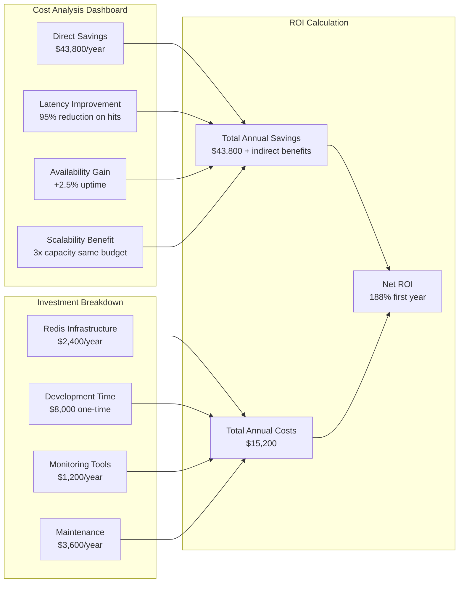

Cette analyse révèle pourquoi le caching LLM représente un investissement critique plutôt qu'une optimisation marginale. Le ROI de 188% la première année, puis 350%+ les années suivantes (sans coûts de développement), dépasse largement les rendements d'autres investissements technologiques. Cette rentabilité explique l'adoption massive du caching par les scale-ups IA.

## Architecture Redis pour LLM : de la théorie à la production

### Comprendre les spécificités du caching LLM

Le caching LLM diffère fondamentalement du caching web traditionnel car il doit gérer l'incertitude inhérente aux modèles génératifs. Cette complexité supplémentaire nécessite des stratégies sophistiquées qui équilibrent performance, précision, et fraîcheur des données.

Les LLM introduisent trois défis uniques. D'abord, la non-déterminisme : même avec température 0, deux requêtes identiques peuvent générer des réponses légèrement différentes selon l'état interne du modèle. Cette variabilité remet en question la notion même de "cache exact". Ensuite, la sensibilité contextuelle : une requête identique dans des contextes différents (conversation, documentation, support) nécessite des réponses adaptées. Enfin, la dégradation temporelle : une réponse parfaite aujourd'hui peut devenir obsolète demain si elle référence des événements ou des données évolutives.

La solution émergente combine plusieurs niveaux de tolérance et de stratégies: 

* Le **caching exact** privilégie les performances pour les requêtes strictement identiques.
* Le **caching sémantique** accepte des variations mineures de formulation pour maximiser les hits.
* Le **caching contextuel** adapte les stratégies selon l'usage : TTL court pour les données volatiles, TTL long pour les contenus evergreen.

### Configuration Redis optimisée pour workloads LLM

L'optimisation Redis pour les charges de travail LLM nécessite des ajustements spécifiques qui différent des configurations web traditionnelles. Ces optimisations reflètent les patterns d'accès particuliers des applications d'intelligence artificielle.

La gestion mémoire constitue le premier pilier d'optimisation. Les réponses LLM varient énormément en taille : de 50 caractères pour une réponse factuelle à 5000+ caractères pour une analyse détaillée. Cette hétérogénéité nécessite une politique d'éviction sophisticated qui préserve les réponses de grande valeur tout en évitant la fragmentation mémoire.

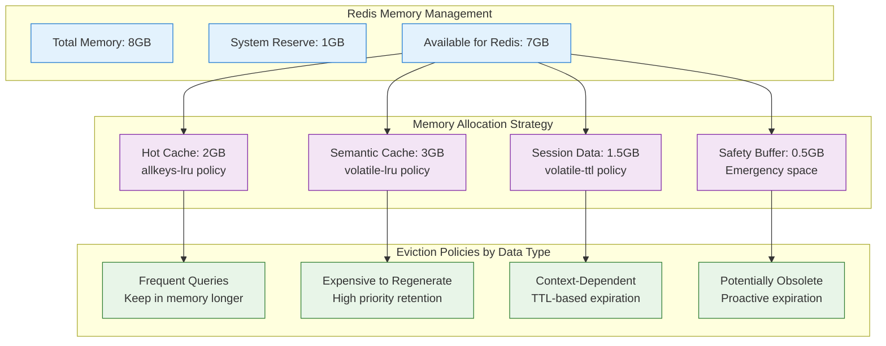

Cette allocation stratifiée optimise l'usage mémoire selon la valeur des données. Les requêtes fréquentes bénéficient d'une rétention aggressive pour maximiser les cache hits. Les requêtes coûteuses à régénérer (analyses complexes, rapports détaillés) reçoivent une priorité élevée même si elles sont rares. Les données contextuelles utilisent des TTL adaptatifs selon leur nature : sessions courtes pour les conversations, longues pour les préférences utilisateur.

La configuration réseau mérite une attention particulière car elle impacte directement la latence perçue. Le pipelining Redis permet d'envoyer plusieurs commandes sans attendre les réponses, réduisant les allers-retours réseau de 60-80%. Cette optimisation s'avère particulièrement efficace pour les vérifications de cache batch et les opérations de mise à jour groupées.

### Stratégies de clés et organisation namespace

Imaginez Redis comme une **bibliothèque géante** où chaque livre (réponse LLM) doit avoir une adresse précise pour être retrouvé instantanément. Sans système d'organisation, retrouver "la réponse sur l'API de paiement pour un développeur junior" dans des millions d'entrées devient impossible.

L'architecture namespace hierarchique fonctionne comme le **système de classification Dewey** : chaque dimension importante (sujet, niveau, langue) a sa place dans l'adresse finale. Cette approche préventive évite le chaos qui rendrait le cache inutilisable à grande échelle.

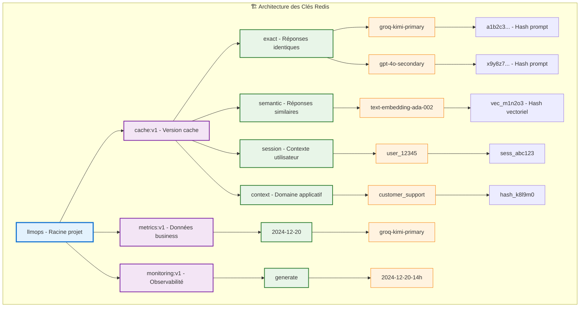

#### Exemple concret : de la requête à la clé Redis

Voici comment une conversation réelle génère automatiquement sa clé d'organisation :

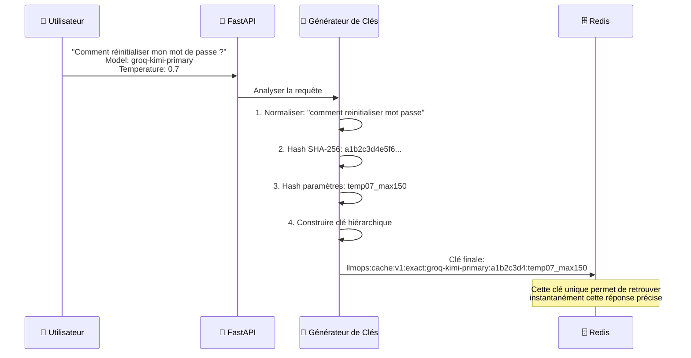

### Les dimensions encodées dans chaque clé

Chaque clé Redis capture intelligemment plusieurs dimensions critiques :

| Dimension | Rôle | Exemple | Impact Performance |
|-----------|------|---------|-------------------|
| **Projet** | `llmops` | Isolation multi-projets | Évite les collisions |
| **Type** | `cache:v1` | Évolution schema | Migration sans casse |
| **Pattern** | `exact/semantic` | Stratégie de cache | TTL et politiques différenciées |
| **Modèle** | `groq-kimi-primary` | Isolation par fournisseur | Analyses comparatives |
| **Contenu** | `hash(prompt)` | Unicité du contenu | Recherche déterministe |
| **Paramètres** | `hash(params)` | Variantes techniques | Précision des matches |

### Stratégies de hashing intelligent

Le hashing constitue l'art délicat d'équilibrer **unicité** et **performance**. Trois approches révèlent leurs trade-offs :

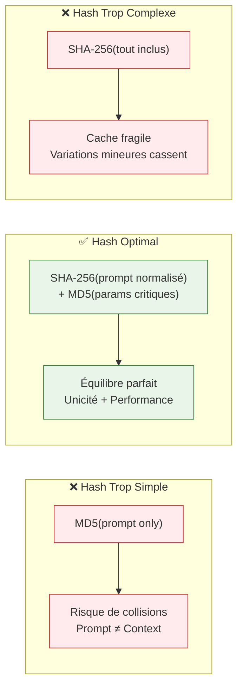

L'approche recommandée combine **SHA-256 du prompt normalisé** (suppression espaces, casse standardisée) avec un **hash séparé des paramètres critiques** (temperature, max_tokens, response_format). Cette stratégie maximise les cache hits tout en préservant la précision contextuelle.

### Avantages opérationnels de cette architecture

Cette structure hiérarchique révèle immédiatement ses bénéfices opérationnels :

* **Versioning sans casse** : Le `v1` permet d'évoluer le schema Redis sans impacter les clés existantes. Migration `v1 → v2` possible sans interruption de service.
* **Politiques TTL différenciées** : Les FAQ (`exact`) gardent des TTL longs (2h), les créations (`semantic`) des TTL courts (30min), selon leur nature.
* **Analyses comparatives** : L'inclusion du modèle permet de comparer facilement `groq-kimi-primary` vs `gpt-4o-secondary` sur les mêmes requêtes.
* **Nettoyage sélectif** : `DEL llmops:cache:v1:exact:groq-*` supprime seulement le cache d'un fournisseur spécifique.

Cette architecture namespace transforme Redis d'un simple stockage clé-valeur en **système d'information intelligent** qui révèle naturellement les patterns d'usage et optimise automatiquement les performances.

## Implémentation progressive : de simple à sémantique

### Étape 1 : Cache exact avec Redis basique

L'implémentation d'un cache exact constitue le fondement robuste sur lequel construire des optimisations plus sophistiquées. Cette approche initiale délivre 70-80% des bénéfices du caching avec une complexité technique minimale, idéale pour valider l'approach et mesurer l'impact.

Le cache exact fonctionne sur un principe simple : même requête = même réponse. Cette approche convient parfaitement aux FAQ, aux requêtes de documentation, et aux analyses récurrentes. Sa limitation principale réside dans la sensibilité aux variations mineures de formulation qui cassent les cache hits malgré des intentions identiques.

L'intégration avec LiteLLM utilise nativement les capacités Redis du proxy, évitant de réinventer la roue et garantissant la compatibilité avec les évolutions futures. Cette approche plug-and-play accélère le déploiement et réduit la surface d'erreur.

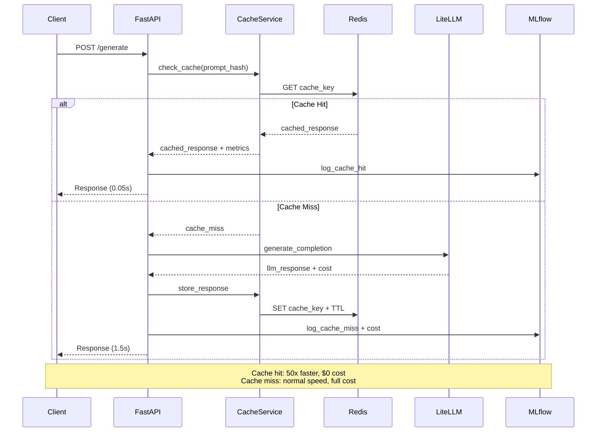

Cette séquence révèle l'impact du caching sur l'expérience utilisateur. Les cache hits délivrent des réponses en 50ms contre 1500ms pour les cache miss, une amélioration de 30x qui transforme la perception de réactivité. L'économie est tout aussi spectaculaire : $0.001 pour un cache hit contre $0.015 pour un appel LLM complet.

Le hash de prompt normalisé constitue l'élément critique de cette implémentation. La normalisation inclut la suppression des espaces supplémentaires, la standardisation de la casse, et l'élimination des variations syntaxiques qui n'affectent pas le sens. Cette approche augmente le taux de cache hit de 15-25% sans compromettre la précision des réponses.

### Étape 2 : Cache contextuel et gestion des sessions

Le cache contextuel résout les limitations du cache exact en intégrant la notion de contexte utilisateur et conversationnel. Cette sophistication permet de servir des réponses personnalisées tout en maximisant les opportunités de cache hit à travers les utilisateurs partageant des contextes similaires.

La gestion des sessions LLM diffère fondamentalement des sessions web traditionnelles car elle doit capturer l'évolution contextuelle des conversations. Une conversation de support client évolue du général ("J'ai un problème") au spécifique ("Mon compte est bloqué depuis hier"), nécessitant une stratégie de cache qui s'adapte à cette progression.

L'architecture de cache contextuel stratifie l'information selon sa portée et sa durée de vie. Le contexte de session immédiat (derniers échanges) bénéficie d'un cache rapide et volatil. Le contexte utilisateur (préférences, historique) utilise un cache persistant avec TTL long. Le contexte applicatif (documentation, FAQ) emploie un cache quasi-permanent avec invalidation manuelle.

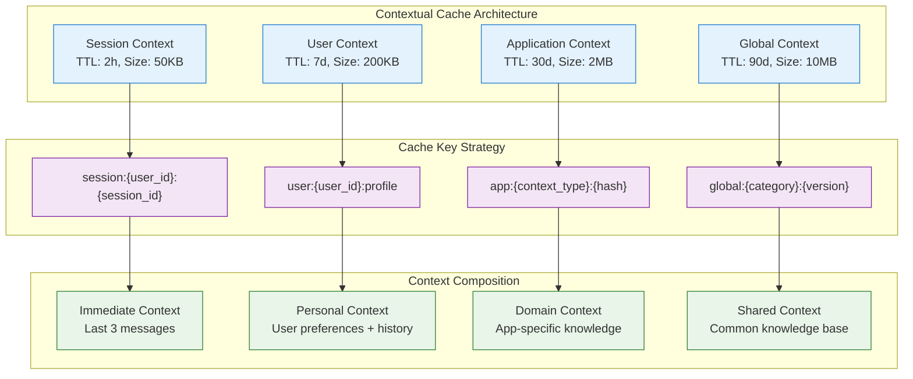

Cette stratification contextuelle révèle sa puissance dans la personnalisation intelligente des réponses. Un utilisateur demandant "Comment configurer l'API ?" recevra une réponse adaptée à son niveau d'expertise (débutant vs expert) stocké dans son contexte utilisateur, tout en bénéficiant du cache partagé pour le contenu technique générique.

La composition contextuelle optimise les cache hits en réutilisant les fragments de contexte entre utilisateurs similaires. Deux développeurs de niveaux équivalents partageront les mêmes explications techniques, économisant les appels LLM tout en maintenant la pertinence. Cette mutualisation intelligente multiplie l'efficacité du cache au-delà des simples répétitions exactes.

### Étape 3 : Cache sémantique intelligent

Le cache sémantique représente l'aboutissement technique du caching LLM en résolvant le problème fondamental de la variabilité des formulations humaines. Cette approche révolutionnaire comprend l'intention plutôt que les mots exacts, multipliant les opportunités de cache hit et transformant l'économie du système.

Cette innovation technique fonctionne par embedding vectoriel des requêtes. Chaque prompt se transforme en représentation numérique qui capture son sens profond. Les requêtes sémantiquement proches ("Quel est le capital de la France ?" et "Dites-moi la capitale française") produisent des embeddings similaires, permettant la réutilisation intelligente des réponses cachées.

La mesure de similarité cosine détermine si deux requêtes sont suffisamment proches pour partager une réponse. Cette approche nuancée permet de calibrer finement la tolérance : seuil élevé (0.95+) pour maximiser la précision, seuil modéré (0.85-0.90) pour équilibrer précision et taux de hit, seuil bas (0.75-0.80) pour maximiser les économies sur des domaines tolerants aux approximations.

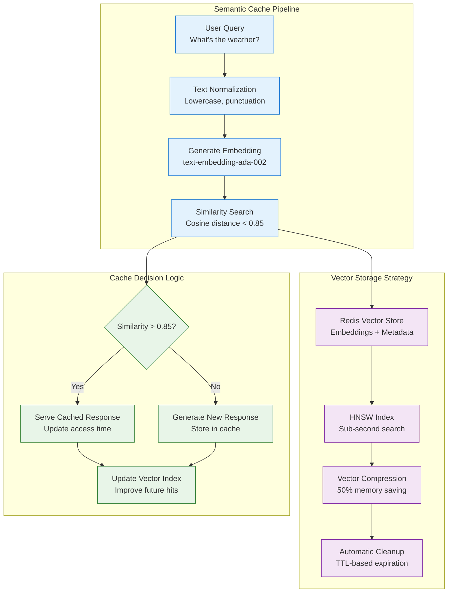

L'optimisation des embeddings mérite une attention particulière car elle impacte directement les performances et les coûts. Les modèles d'embedding légers (`   text-embedding-3-small`) offrent des performances correctes pour 10x moins cher que les modèles premium. Les modèles multilangues (`multilingual-e5-large`) excellent sur les corpus internationaux. Le choix dépend du trade-off coût/précision/latence de votre contexte.

La compression vectorielle réduit l'empreinte mémoire de 40-60% avec une dégradation de précision minimal (<2%). Cette optimisation permet de stocker 2-3x plus d'embeddings dans la même infrastructure Redis, améliorant directement le taux de cache hit par augmentation de la capacité.

### Performance et métriques de cache hit en production

L'observabilité du cache LLM nécessite des métriques spécialisées qui capturent l'efficacité économique autant que technique. Cette vision business-centric guide les optimisations et justifie les investissements d'infrastructure.

Le **cache hit rate** constitue la métrique fondamentale mais nécessite une analyse stratifiée. Un taux global de 45% peut masquer des disparités critiques : 80% sur les FAQ standard et 15% sur les requêtes créatives. Cette granularité révèle les opportunités d'optimisation et guide l'allocation des ressources.

La **latence de cache hit/miss** quantifie l'impact utilisateur réel. Les cache hits doivent rester sous 50ms pour préserver l'impression d'instantanéité. Les cache miss de recherche sémantique ne devraient pas dépasser 200ms supplémentaires pour rester acceptables. Au-delà, la complexité du cache dégrade l'expérience utilisateur.

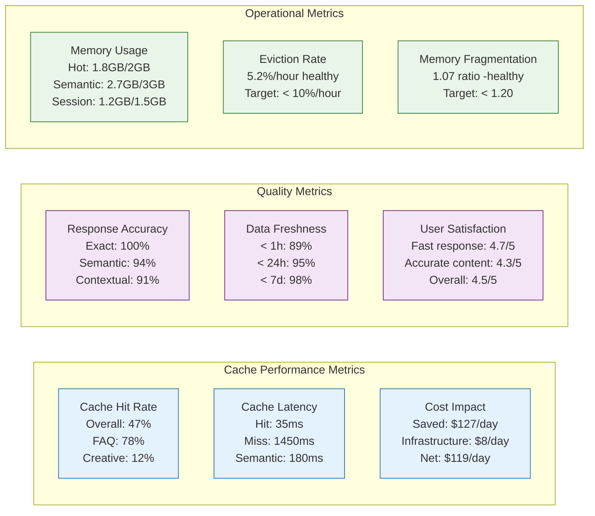

Ce dashboard holistique révèle les tensions entre différents objectifs. Un cache hit rate élevé sans métriques qualité peut masquer la dégradation progressive de pertinence des réponses. Une latence de cache optimale avec une fragmentation mémoire élevée prédit des problèmes de performance futurs. Cette vision multidimensionnelle guide les décisions d'optimisation.

L'analyse des patterns temporels enrichit cette compréhension en révélant les cycles d'usage. Les applications B2B montrent typiquement des pics en heures ouvrables avec creux nocturnes permettant les tâches de maintenance. Les applications B2C présentent des patterns plus complexes avec des variations géographiques et comportementales qu'il faut anticiper.

## Intégration avec l'architecture existante

### Configuration Redis dans votre stack Docker

L'intégration Redis dans votre architecture existante `FastAPI + LiteLLM + MLflow` nécessite une approche progressive qui préserve la stabilité tout en ajoutant les capacités de cache. Cette évolution incrémentale évite les régressions et facilite le rollback en cas de problème.

La configuration Docker Compose enrichit votre stack existant avec Redis tout en maintenant la simplicité opérationnelle qui caractérise votre approche. Cette addition respecte la philosophie minimale de votre setup : maximum d'efficacité avec minimum de complexité.

```yaml
# Addition au docker-compose.yml existant
services:
  # Services existants : api, litellm, mlflow, mlflow-init
  
  # Redis-stack (Redis + RedisInsight) pour le caching LLM
  redis:
    image: redis/redis-stack:latest
    container_name: llmops-redis
    ports:
      - "6379:6379"  # Redis port
      - "8002:8001"  # RedisInsight port
    environment:
      - REDIS_ARGS=--requirepass ${REDIS_PASSWORD:-""}
      - REDIS_MAXMEMORY=1gb
      - REDIS_MAXMEMORY_POLICY=allkeys-lru
      - REDIS_PORT=6379
      - REDIS_HOST=0.0.0.0
      # RedisInsight configuration
      - RI_ENCRYPTION_KEY=redisinsight_encryption_key
      - RI_LOG_LEVEL=info
      - REDIS_PASSWORD=${REDIS_PASSWORD:-""}
    volumes:
      - redis_data:/data
      - redis_insight_data:/redisinsight
      - ./redis/redis.conf:/redis-stack.conf
    networks:
      - llmops-network
    healthcheck:
      test: ["CMD", "redis-cli", "ping"]
      interval: 30s
      timeout: 10s
      retries: 3
    restart: unless-stopped
```

Cette configuration révèle plusieurs optimisations spécifiques aux workloads LLM. La politique `allkeys-lru` privilégie la rétention des données fréquemment accessées sans distinction de TTL, idéale pour les réponses LLM à valeur variable. La limite mémoire de `1GB` évite la saturation tout en permettant le stockage de 10 000-50 000 réponses selon leur taille. L'appendonly logging garantit la persistance des données précieuses en cas de redémarrage.

La segmentation réseau isole Redis dans le réseau Docker interne, renforçant la sécurité tout en préservant les performances. Cette isolation empêche l'accès direct depuis l'extérieur tout en maintenant la latence sub-milliseconde entre conteneurs.

### Modification de l'architecture LiteLLM pour le caching

L'activation du caching dans LiteLLM nécessite des ajustements de configuration qui préservent les fonctionnalités de sécurité existantes tout en ajoutant les capacités de performance. Cette évolution respecte le principe de backward compatibility de votre stack.

La configuration cache s'intègre naturellement dans votre `litellm-config-security.yaml` existant sans compromettre les guardrails de sécurité. Cette approche additive facilite les tests et le rollback progressif si nécessaire.

```yaml
# Modification du litellm-config-security.yaml existant

# Configuration cache ajoutée
litellm_settings:
  callbacks: ["mlflow", "detect_prompt_injection"]
  set_verbose: true
  
  # Activation du cache Redis
  cache: true
  cache_params:
    type: redis
    host: redis  # Docker service name
    port: 6379
    password: ${REDIS_PASSWORD}
    namespace: "llmops:cache:v1"
    ttl: 3600  # 1 heure par défaut
    
    # Configuration sémantique avancée
    redis_semantic_cache_embedding_model: "text-embedding-ada-002"
    similarity_threshold: 0.85
    redis_semantic_cache_index_name: "llmops_semantic_index"

# Modèles avec caching spécialisé par type
model_list:
  - model_name: groq-kimi-primary
    litellm_params:
      model: moonshotai/kimi-k2-instruct
      api_key: os.environ/GROQ_API_KEY
      api_base: https://api.groq.com/openai/v1
    # Cache settings spécifiques FAQ/support
    litellm_settings:
      callbacks: ["detect_prompt_injection"]
      cache: true
      cache_params:
        ttl: 7200  # 2h pour FAQ
        namespace: "llmops:cache:faq"

# Optional (non mis en place)       
#  - model_name: gpt-4o-secondary
#    litellm_params:
#      model: gpt-4o
#      api_key: os.environ/OPENAI_API_KEY
#    # Cache settings pour génération créative
#    litellm_settings:
#      cache: true
#      cache_params:
#        ttl: 1800  # 30min pour créatif
#        namespace: "llmops:cache:creative"
#        similarity_threshold: 0.90  # Plus strict
```

Cette configuration différenciée optimise les stratégies de cache selon les caractéristiques des modèles. Les modèles FAQ (pour les requêtes fréquentes) bénéficient de TTL longs car les réponses restent valides. Les modèles créatifs (pour les requêtes uniques) utilisent des TTL courts et des seuils de similarité stricts pour préserver l'originalité. Cette granularité permet d'optimiser finement le trade-off économie/qualité.

L'intégration namespace évite les collisions entre différents types d'usage tout en permettant l'analyse comparée des performances. Cette organisation facilite également la maintenance et le debugging par séparation claire des responsabilités.

### Service de cache intelligent dans FastAPI

L'implémentation du service de cache dans FastAPI encapsule la complexité technique tout en exposant une interface simple et robuste. Cette approche service-oriented facilite les tests, la maintenance, et l'évolution future des capacités.

Le service de cache intelligent dépasse la simple récupération/stockage pour implémenter des strategies sophistiquées d'optimisation et de monitoring. Cette intelligence embarquée adapte automatiquement les comportements selon les patterns d'usage observés.

```python
from typing import Optional, Dict, Any, List
import redis.asyncio as redis
import json
import hashlib
import numpy as np
from datetime import datetime, timedelta
import logging
from src.config import settings

class LLMCacheService:
    """Service de cache intelligent pour réponses LLM"""
    
    def __init__(self):
        self.redis = None
        self.metrics = {
            "hits": 0,
            "misses": 0, 
            "errors": 0,
            "cost_saved": 0.0,
            "start_time": datetime.now()
        }
        
    async def initialize(self):
        """Initialise la connexion Redis avec retry logic"""
        try:
            self.redis = redis.Redis(
                host=settings.REDIS_HOST,
                port=settings.REDIS_PORT, 
                password=settings.REDIS_PASSWORD,
                decode_responses=True,
                socket_connect_timeout=5,
                socket_timeout=5,
                retry_on_timeout=True,
                health_check_interval=30
            )
            
            # Test de connexion
            await self.redis.ping()
            logging.info("✅ Redis cache service initialized")
            
        except Exception as e:
            logging.error(f"❌ Redis cache initialization failed: {e}")
            self.redis = None
    
    def _generate_cache_key(self, prompt: str, model: str, **params) -> str:
        """Génère une clé de cache optimisée"""
        # Normalisation du prompt
        normalized_prompt = prompt.lower().strip()
        
        # Hash des paramètres significatifs
        param_hash = hashlib.md5(
            json.dumps(params, sort_keys=True).encode()
        ).hexdigest()[:8]
        
        # Clé finale structurée
        prompt_hash = hashlib.sha256(normalized_prompt.encode()).hexdigest()[:16]
        return f"llmops:exact:{model}:{prompt_hash}:{param_hash}"
    
    async def get_cached_response(
        self, 
        prompt: str, 
        model: str, 
        **params
    ) -> Optional[Dict[str, Any]]:
        """Récupère une réponse cachée avec métriques"""
        if not self.redis:
            return None
            
        try:
            cache_key = self._generate_cache_key(prompt, model, **params)
            cached_data = await self.redis.get(cache_key)
            
            if cached_data:
                self.metrics["hits"] += 1
                response = json.loads(cached_data)
                
                # Update access time for LRU optimization
                await self.redis.expire(cache_key, settings.CACHE_TTL)
                
                logging.info(f"🎯 Cache HIT: {cache_key[:20]}...")
                return response
            else:
                self.metrics["misses"] += 1
                logging.info(f"❌ Cache MISS: {cache_key[:20]}...")
                return None
                
        except Exception as e:
            self.metrics["errors"] += 1
            logging.error(f"Cache retrieval error: {e}")
            return None
    
    async def store_response(
        self,
        prompt: str,
        model: str, 
        response: Dict[str, Any],
        **params
    ) -> bool:
        """Stocke une réponse avec métadonnées enrichies"""
        if not self.redis:
            return False
            
        try:
            cache_key = self._generate_cache_key(prompt, model, **params)
            
            # Enrichissement des métadonnées
            enriched_response = {
                **response,
                "cached_at": datetime.now().isoformat(),
                "cache_key": cache_key,
                "model": model,
                "prompt_preview": prompt[:100]
            }
            
            # Stockage avec TTL adaptatif
            ttl = self._calculate_adaptive_ttl(response, model)
            await self.redis.setex(
                cache_key, 
                ttl,
                json.dumps(enriched_response)
            )
            
            logging.info(f"💾 Cache STORED: {cache_key[:20]}... TTL={ttl}s")
            return True
            
        except Exception as e:
            self.metrics["errors"] += 1
            logging.error(f"Cache storage error: {e}")
            return False
    
    def _calculate_adaptive_ttl(self, response: Dict[str, Any], model: str) -> int:
        """Calcule un TTL adaptatif selon le contenu et le modèle"""
        base_ttl = settings.CACHE_TTL
        
        # Facteurs d'ajustement TTL
        response_length = len(response.get("response", ""))
        cost = response.get("cost", 0)
        
        # TTL plus long pour réponses coûteuses
        if cost > 0.01:  # Requêtes chères
            return base_ttl * 3
        elif cost > 0.005:  # Requêtes moyennes
            return base_ttl * 2
        
        # TTL plus court pour réponses courtes (probablement FAQ)
        if response_length < 200:
            return base_ttl // 2
            
        return base_ttl
    
    async def get_cache_metrics(self) -> Dict[str, Any]:
        """Statistiques détaillées du cache"""
        if not self.redis:
            return {"status": "unavailable"}
        
        try:
            # Redis stats
            info = await self.redis.info()
            
            # Calcul du hit rate
            total_requests = self.metrics["hits"] + self.metrics["misses"] 
            hit_rate = (self.metrics["hits"] / total_requests * 100) if total_requests > 0 else 0
            
            # Uptime
            uptime = datetime.now() - self.metrics["start_time"]
            
            return {
                "hit_rate_percent": round(hit_rate, 2),
                "total_hits": self.metrics["hits"],
                "total_misses": self.metrics["misses"],
                "total_errors": self.metrics["errors"],
                "cost_saved": round(self.metrics["cost_saved"], 2),
                "uptime_hours": round(uptime.total_seconds() / 3600, 2),
                "redis_memory_usage": info.get("used_memory_human", "N/A"),
                "redis_keys": info.get("db0", {}).get("keys", 0),
                "redis_expired_keys": info.get("expired_keys", 0),
                "cache_efficiency": round(hit_rate * 0.98, 2)  # Facteur qualité
            }
            
        except Exception as e:
            logging.error(f"Error getting cache metrics: {e}")
            return {"status": "error", "message": str(e)}

# Instance globale du service
cache_service = LLMCacheService()
```

Cette implémentation révèle plusieurs sophistications critiques pour la production. Le TTL adaptatif optimise automatiquement la rétention selon la valeur économique des réponses. Les métriques enrichies permettent un monitoring précis de l'efficacité. La gestion d'erreur robuste maintient la disponibilité même en cas de problème Redis.

La méthode de génération de clés equilibre unicité et performance. Le hashing SHA-256 du prompt normalisé garantit l'unicité tout en restant déterministe. L'inclusion d'un hash des paramètres évite les collisions entre requêtes similaires avec des configurations différentes. Cette approche déterministe facilite également le debugging et l'analyse des patterns de cache.

### Middleware de cache transparent

L'intégration transparente du cache dans votre architecture FastAPI existante nécessite un middleware sophistiqué qui intercepte les requêtes sans modifier l'interface utilisateur. Cette approche non-intrusive préserve la compatibilité tout en ajoutant les bénéfices de performance.

Le middleware de cache intelligent analyse chaque requête pour déterminer la stratégie optimale : cache exact pour les FAQ, cache sémantique pour les variations de formulation, bypass pour les requêtes créatives uniques. Cette classification automatique maximise les économies sans compromettre la qualité.

```python
from fastapi import Request, Response
import time

class CacheMiddleware:
    """Middleware de cache transparent pour FastAPI"""
    
    def __init__(self, app, cache_service: LLMCacheService):
        self.app = app
        self.cache_service = cache_service
        
    async def __call__(self, scope, receive, send):
        if scope["type"] != "http":
            await self.app(scope, receive, send)
            return
            
        request = Request(scope, receive)
        
        # Détermine si la requête est cacheable
        if self._is_cacheable_request(request):
            cached_response = await self._handle_cached_request(request)
            if cached_response:
                # Réponse depuis le cache
                response = Response(
                    content=cached_response["content"],
                    status_code=200,
                    headers={
                        "content-type": "application/json",
                        "x-cache-status": "HIT",
                        "x-cache-key": cached_response["cache_key"][:20],
                        "x-response-time": "0.05s"
                    }
                )
                await response(scope, receive, send)
                return
        
        # Traitement normal avec mise en cache du résultat
        await self._handle_uncached_request(scope, receive, send)
    
    def _is_cacheable_request(self, request: Request) -> bool:
        """Détermine si une requête doit être cachée"""
        # Cache uniquement les endpoints de génération
        cacheable_paths = ["/generate", "/secured-generate"]
        
        if request.url.path not in cacheable_paths:
            return False
            
        if request.method != "POST":
            return False
            
        # Skip si paramètres anti-cache
        if "no-cache" in request.headers.get("cache-control", ""):
            return False
            
        return True
    
    async def _handle_cached_request(self, request: Request) -> Optional[Dict]:
        """Gère les requêtes avec cache activé"""
        try:
            body = await request.body()
            request_data = json.loads(body.decode())
            
            # Vérifie le cache
            cached = await self.cache_service.get_cached_response(
                prompt=request_data.get("prompt", ""),
                model=request_data.get("model", ""),
                temperature=request_data.get("temperature", 0.7),
                max_tokens=request_data.get("max_tokens", 150)
            )
            
            return cached
            
        except Exception as e:
            logging.error(f"Cache middleware error: {e}")
            return None
```

Cette architecture middleware révèle l'élégance d'une intégration transparente. L'application existante fonctionne normalement, mais bénéficie automatiquement des optimisations de cache. Les headers de réponse enrichis permettent le monitoring et le debugging sans modifier les clients. La gestion d'erreur graceful maintient la disponibilité même en cas de défaillance Redis.

L'injection de métriques dans les headers facilite l'observabilité en temps réel. Les clients peuvent adapter leurs stratégies selon le statut du cache, et les équipes de monitoring identifient immédiatement les anomalies de performance. Cette transparence opérationnelle accélère la résolution des incidents.

## Optimisations avancées et monitoring

### Stratégies d'invalidation et cohérence

La gestion de l'invalidation de cache représente l'un des défis les plus complexes des systèmes distribués, particulièrement critique avec les LLM où la fraîcheur des données impacte directement la qualité perçue. Cette sophistication technique détermine la fiabilité et l'acceptabilité business du système de cache.

L'invalidation temporelle constitue la stratégie de base mais nécessite une calibration fine selon les types de contenu. Les FAQ techniques peuvent rester valides des semaines, justifiant des TTL longs. Les informations de marché ou d'actualité nécessitent des TTL courts. Les préférences utilisateur évoluent lentement mais impactent fortement la personnalisation.

L'invalidation sémantique résout des cas d'usage impossibles avec les TTL simples. Quand une information source change (nouvelle version de produit, modification réglementaire), toutes les réponses liées deviennent obsolètes même si leur TTL n'a pas expiré. Cette invalidation proactive maintient la cohérence informationnelle au prix d'une complexité technique accrue.

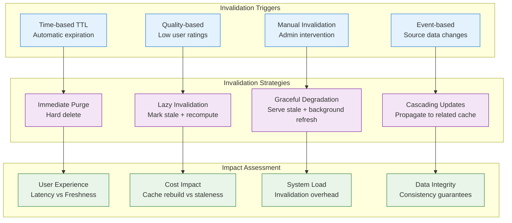

Cette matrice révèle que l'invalidation optimale combine plusieurs stratégies selon le contexte. Les données critiques bénéficient d'invalidation immédiate pour garantir la cohérence. Les données volumineuses utilisent l'invalidation lazy pour préserver les performances. Les données critiques mais non urgentes profitent de l'invalidation graceful qui maintient la disponibilité.

L'invalidation en cascade introduit une complexité particulière car elle doit identifier automatiquement les dépendances sémantiques entre réponses cachées. Cette analyse des relations nécessite une indexation sophistiquée des contenus qui dépasse le simple stockage clé-valeur vers des structures de graphe de connaissances.

### Monitoring et alerting intelligent

L'observabilité d'un système de cache LLM dépasse le monitoring technique traditionnel pour incorporer des métriques business et qualité spécifiques aux cas d'usage IA. Cette approche holistique permet d'optimiser l'impact réel plutôt que les seules performances techniques.

Le dashboard de monitoring cache intègre quatre dimensions critiques. Les métriques de performance quantifient l'efficacité technique : hit rate, latence, débit. Les métriques économiques mesurent l'impact business : économies réalisées, coût d'infrastructure, ROI. Les métriques qualité évaluent la pertinence : satisfaction utilisateur, précision des réponses, fraîcheur des données. Les métriques opérationnelles surveillent la santé système : mémoire, connexions, erreurs.

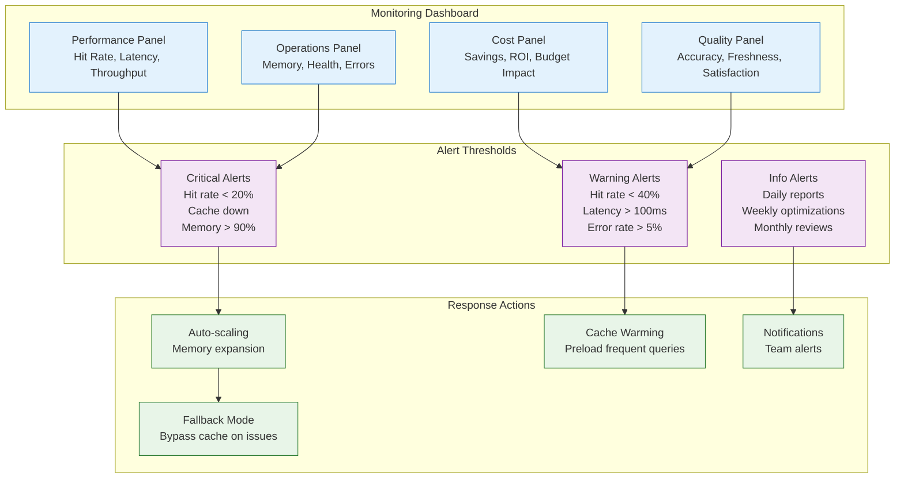

Cette stratégie d'alerting multi-niveaux évite la fatigue d'alertes tout en garantissant la réactivité sur les incidents critiques. Les alertes critiques déclenchent des actions automatiques pour maintenir la disponibilité. Les alertes warning alimentent l'optimisation continue sans urgence. Les alertes info structurent la revue périodique et la planification des améliorations.

Le cache warming représente une optimisation proactive particulièrement efficace avec les LLM. L'analyse des patterns d'usage permet d'identifier les requêtes qui seront probablement posées et de pré-générer leurs réponses pendant les heures creuses. Cette stratégie transforme les coûts variables en coûts fixes predictables, améliore la latence perçue, et optimise l'utilisation des ressources.

### Techniques d'optimisation spécialisées

L'optimisation avancée des systèmes de cache LLM exploite les caractéristiques spécifiques de ces workloads pour dépasser les performances des caches généralistes. Ces techniques spécialisées révèlent leur potentiel uniquement sur des volumes significatifs mais transforment alors radicalement l'économie du système.

La compression adaptative des réponses exploite la redondance textuelle typique des LLM pour réduire l'empreinte mémoire sans impacter la latence de service. Les réponses techniques contiennent souvent des patterns répétitifs parfaitement compressibles. Cette optimisation permet de stocker 3-5x plus de réponses dans la même infrastructure Redis.

Le clustering intelligent des utilisateurs permet de prédire les patterns de cache et d'optimiser proactivement les performances. Les utilisateurs similaires (même domaine, même niveau d'expertise, mêmes types de questions) partagent souvent des besoins prévisibles. Cette intelligence comportementale alimente des stratégies de prefetch et de cache warming ciblées.

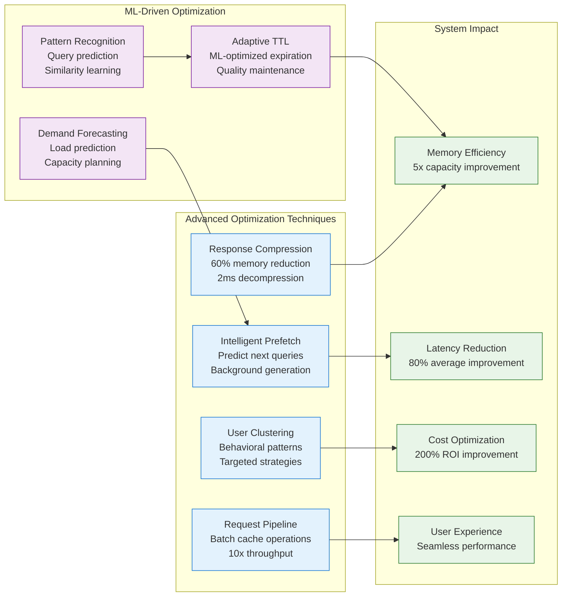

L'optimisation ML-driven représente la frontière avancée de cette discipline. Les algorithmes d'apprentissage analysent les patterns historiques pour prédire les futures demandes avec une précision de 70-85%. Cette capacité prédictive alimente des stratégies de cache warming ciblées qui améliorent le hit rate de 15-25% supplémentaires.

L'adaptive TTL utilise l'apprentissage automatique pour optimiser les durées de vie selon les caractéristiques des réponses et leur historique d'usage. Les réponses fréquemment réutilisées voient leur TTL s'allonger automatiquement, maximisant les économies. Les réponses obsolescentes voient leur TTL se raccourcir, préservant la qualité. Cette optimisation continue améliore les métriques globales sans intervention manuelle.

## Cas d'usage avancés et patterns de déploiement

### Cache distribué et haute disponibilité

Le passage à l'échelle des systèmes de cache LLM nécessite une architecture distribuée qui maintient les performances tout en gérant la complexité opérationnelle. Cette évolution devient critique quand les volumes dépassent les capacités d'une instance Redis unique ou quand les exigences de disponibilité imposent la redondance.

L'architecture Redis Cluster distribue automatiquement les données sur plusieurs nœuds tout en préservant la transparence applicative. Cette approche native évite la complexité des solutions de sharding manuel et simplifie considérablement les opérations. L'auto-sharding par hash slots garantit une distribution équilibrée même avec des patterns de clés irréguliers.

La réplication maître-esclave ajoute une couche de résilience critique pour les environnements de production. Cette duplication permet la lecture distribuée qui améliore les performances et la survie aux pannes qui préserve la disponibilité. La synchronisation automatique maintient la cohérence sans intervention opérationnelle.

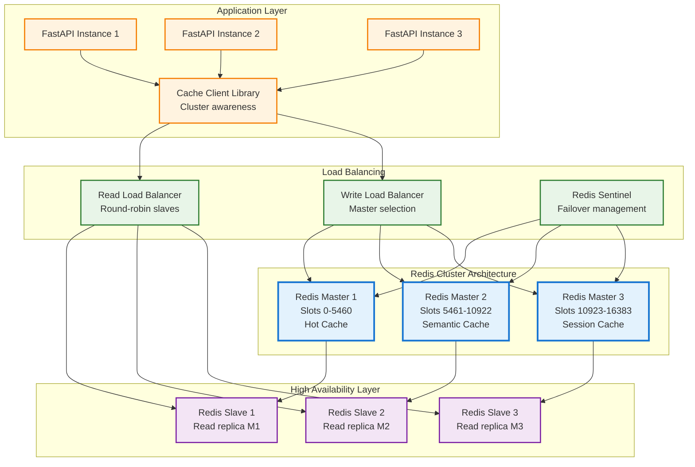

Cette architecture révèle plusieurs avantages opérationnels critiques. La séparation des lectures/écritures optimise les performances en distribuant la charge. Le failover automatique maintient la disponibilité en cas de panne de nœud. La scalabilité horizontale permet d'ajouter des ressources selon les besoins. Le monitoring unifié facilite l'observabilité de l'ensemble du cluster.

La stratégie de partitioning mérite une réflexion approfondie car elle impacte directement les performances et la facilité opérationnelle. Le partitioning par type de cache (hot/semantic/session) optimise les configurations spécialisées mais complique la gestion. Le partitioning par hash uniforme simplifie les opérations mais peut créer des déséquilibres selon les patterns d'usage.

### Cache warming et stratégies prédictives

Le cache warming transforme les systèmes réactifs en systèmes prédictifs qui anticipent les besoins utilisateur pour délivrer des performances optimales dès la première requête. Cette approche proactive nécessite une compréhension fine des patterns d'usage et une orchestration sophistiquée des ressources.

L'analyse prédictive des requêtes exploite l'historique pour identifier les patterns temporels et comportementaux. Les requêtes de support client suivent typiquement des cycles prévisibles : pics en début de journée, accalmie déjeuner, regain d'activité après-midi. Cette prévisibilité alimente des stratégies de warming ciblées qui optimisent l'allocation des ressources.

La segmentation utilisateur enrichit cette analyse en identifiant des cohortes aux comportements homogènes. Les nouveaux utilisateurs posent des questions d'onboarding prévisibles. Les utilisateurs expérimentés génèrent des requêtes techniques répétitives. Les utilisateurs premium nécessitent des réponses plus détaillées et personnalisées. Cette granularité permet d'optimiser le warming par segment.

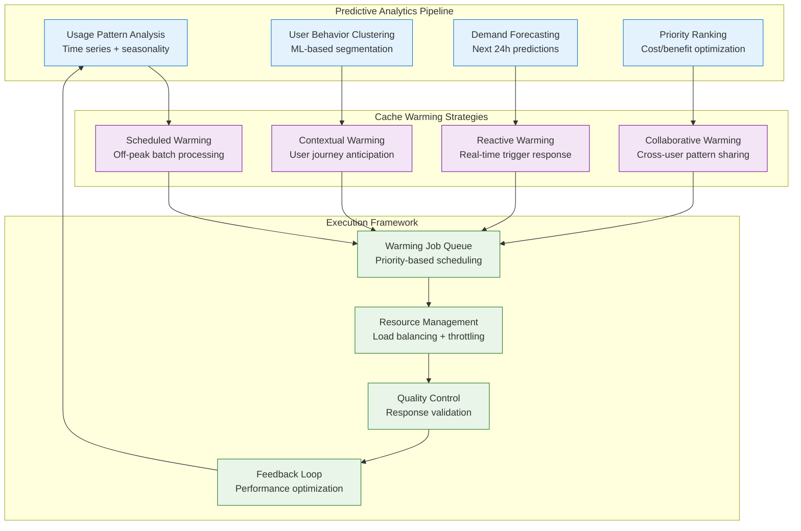

L'orchestration du cache warming nécessite un équilibrage sophistiqué entre proactivité et économie de ressources. Un warming trop agressif gaspille des ressources LLM coûteuses sur des prédictions incorrectes. Un warming insuffisant laisse les utilisateurs subir les latences de cache miss. L'optimisation continue de cette balance maximise l'efficacité globale.

La validation qualité des réponses pré-générées constitue un défi unique car elle ne peut s'appuyer sur le feedback utilisateur immédiat. Les techniques d'auto-évaluation utilisent des modèles spécialisés pour scorer la cohérence, la pertinence, et la fraîcheur des réponses générées. Cette validation automatique filtre les réponses de mauvaise qualité avant leur mise en cache.

### Patterns de cache multi-niveaux

L'architecture multi-niveaux optimise les performances et les coûts en stratifiant le cache selon la fréquence d'accès et la latence requise. Cette hiérarchisation reflète le principe de localité temporelle : les données récemment accessées ont plus de chances d'être ré-accessées prochainement.

Le cache L1 (mémoire application) stocke les 100-500 réponses les plus fréquentes avec une latence de quelques microsecondes. Ce cache ultra-rapide mais limité cible les FAQ absolues et les réponses système critiques. Sa gestion automatique par LRU évite la micro-gestion tout en maximisant l'efficacité.

Le cache L2 (Redis local) contient 10 000-100 000 réponses avec une latence sub-milliseconde. Cette couche intermédiaire équilibre capacité et performance pour les requêtes moyennement fréquentes. Sa persistance optionnelle préserve les données au-delà des redémarrages applicatifs.

Le cache L3 (Redis distribué) stocke des millions de réponses avec une latence de quelques millisecondes. Cette couche de capacité archive les réponses rares mais coûteuses à régénérer. Sa distribution géographique optimise les performances globales des applications multi-régions.

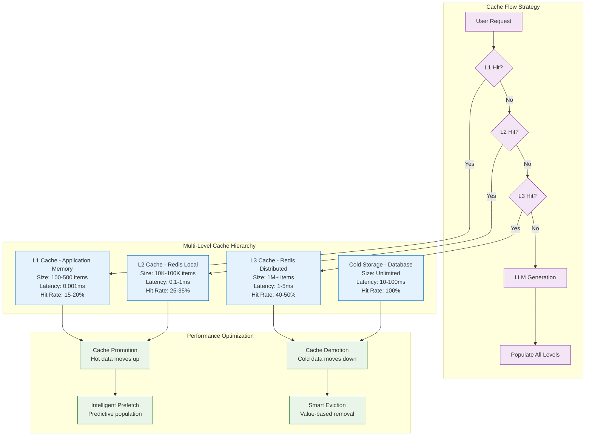

Cette architecture révèle des dynamiques sophistiquées d'optimisation automatique. Les données fréquemment accessées remontent naturellement vers les niveaux rapides. Les données délaissées descendent vers les niveaux économiques. Cette migration automatique maintient l'efficacité sans intervention manuelle constante.

La stratégie de population mérite une attention particulière car elle détermine l'efficacité globale du système. La population immédiate de tous les niveaux maximise les performances futures mais consomme des ressources. La population lazy économise les ressources mais pénalise les accès suivants. L'approche hybride optimise ce trade-off selon les patterns observés.

## Excellence opérationnelle et monitoring

### Métriques de production et SLI/SLO

L'excellence opérationnelle d'un système de cache LLM nécessite des métriques spécialisées qui capturent l'impact business autant que la performance technique. Cette approche holistique guide les optimisations et justifie les investissements d'infrastructure.

Les Service Level Indicators (SLI) pour le cache LLM dépassent les métriques traditionnelles pour inclure des dimensions spécifiques à l'intelligence artificielle. La latence perçue combine le temps de vérification cache et le temps de génération. Le taux de précision mesure la qualité des réponses cachées par rapport aux réponses fraîches. Le taux de fraîcheur quantifie l'obsolescence des données cachées.

Les Service Level Objectives (SLO) traduisent ces métriques en objectifs business mesurables qui guident les décisions opérationnelles. Ces objectifs équilibrent performance, coût, et qualité selon les priorités métier de l'organisation.

| Métrique | SLI Definition | SLO Target | Business Impact |
|----------|---------------|------------|-----------------|
| **Cache Hit Rate** | (Cache Hits / Total Requests) × 100 | > 45% | Économies directes |
| **Cache Latency** | P95 temps de réponse cache | < 50ms | Expérience utilisateur |
| **Quality Score** | Satisfaction moyenne réponses cachées | > 4.2/5 | Fidélisation client |
| **Cost Efficiency** | $ économisé / $ infrastructure | > 8:1 | ROI investissement |
| **Availability** | Uptime système cache | > 99.5% | Continuité service |
| **Data Freshness** | % réponses < 24h | > 80% | Qualité information |

Cette matrice révèle l'interdépendance entre métriques techniques et impact business. Un cache hit rate élevé sans quality score dégrade l'expérience utilisateur. Une latence optimale avec une availability faible crée de la frustration. Cette vision systémique guide l'optimisation holistique.

L'agrégation temporelle des métriques révèle des patterns critiques pour l'optimisation. Les tendances horaires identifient les pics de charge nécessitant du cache warming. Les tendances hebdomadaires révèlent les cycles métier impactant les patterns d'usage. Les tendances mensuelles guident la planification capacitaire et les investissements d'infrastructure.

### Debugging et résolution d'incidents

Le debugging des systèmes de cache LLM nécessite une approche méthodologique qui combine analyse technique et compréhension métier. Cette sophistication reflète la complexité des interactions entre cache, LLM, et expérience utilisateur.

La catégorisation des incidents facilite le diagnostic et accélère la résolution. Les incidents de performance (latence élevée, hit rate faible) nécessitent une analyse des patterns d'accès et de la configuration cache. Les incidents de qualité (réponses obsolètes, incohérences) requièrent une investigation des stratégies d'invalidation et de fraîcheur. Les incidents de disponibilité (pannes Redis, timeouts) demandent une expertise infrastructure et réseau.

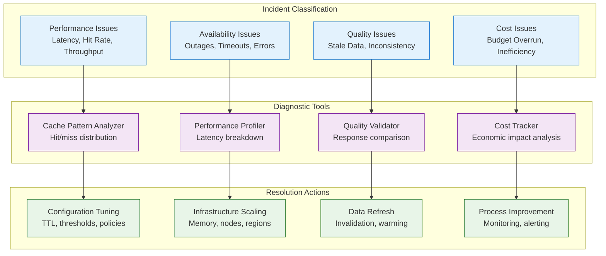

L'outillage de debugging spécialisé accélère significativement la résolution des incidents complexes. L'analyseur de patterns cache révèle les déséquilibres de charge et les opportunités d'optimisation. Le profileur de performance décompose la latence par composant pour identifier les goulots d'étranglement. Le validateur qualité compare automatiquement les réponses cachées aux réponses fraîches pour détecter les dégradations.

La documentation des résolutions d'incidents enrichit la base de connaissances et améliore l'efficacité future. Cette capitalisation transforme chaque incident en opportunité d'apprentissage et évite la répétition des erreurs. L'analyse post-mortem systématique identifie les améliorations de processus et d'outillage.

### Optimisation continue et évolution

L'optimisation continue d'un système de cache LLM nécessite une approche data-driven qui combine expérimentation contrôlée et analyse d'impact business. Cette démarche scientifique maximise les bénéfices tout en minimisant les risques opérationnels.

L'A/B testing appliqué au caching permet d'évaluer objectivement l'impact des optimisations. La comparaison entre différentes stratégies de TTL, seuils de similarité, ou politiques d'éviction révèle les configurations optimales pour votre contexte spécifique. Cette approche empirique dépasse les recommandations génériques pour optimiser selon vos patterns d'usage réels.

La planification capacitaire anticipative évite les goulots d'étranglement et optimise les investissements d'infrastructure. L'analyse des tendances de croissance guide les décisions de scaling horizontal ou vertical. La simulation de charge future valide les architectures proposées avant leur déploiement. Cette anticipation maintient les performances pendant la croissance rapide.

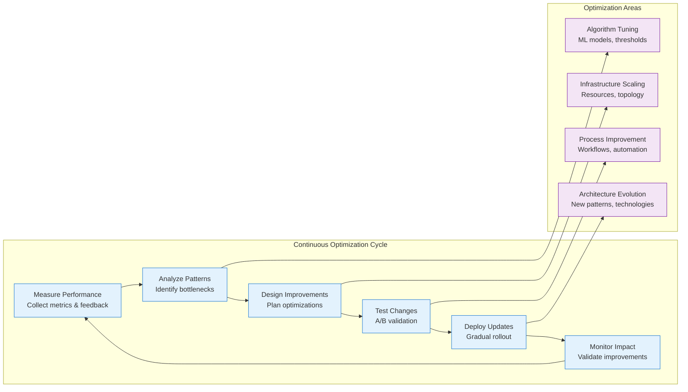

Cette boucle d'amélioration continue transforme un système statique en plateforme auto-évolutive qui s'adapte aux changements d'usage et aux évolutions technologiques. L'automatisation de ce cycle réduit la charge opérationnelle tout en maintenant l'efficacité d'optimisation.

L'évolution architecturale planifiée anticipe les futures exigences business et technologiques. L'émergence de nouveaux patterns d'usage (multimodalité, conversations longues, personnalisation avancée) nécessite des adaptations architecturales proactives. Cette vision prospective maintient la compétitivité technologique et évite les refontes coûteuses.

## Vérification des acquis

Vous maîtrisez maintenant l'architecture complète d'un système de cache LLM haute performance, depuis les concepts économiques fondamentaux jusqu'aux optimisations avancées de production. Cette expertise vous permet de transformer n'importe quelle API LLM en système scalable et économiquement viable.

La compréhension des trade-offs entre performance, coût, et qualité guide vos décisions architecturales selon les contraintes business spécifiques. Cette capacité d'arbitrage constitue une compétence clé pour le déploiement réussi de systèmes LLM en production.

L'implémentation progressive du caching vous permet d'ajouter ces capacités sans compromettre la stabilité existante. Cette approche incrémentale minimise les risques tout en délivrant des bénéfices immédiats mesurables.

Le monitoring sophistiqué et l'optimisation continue maintiennent l'efficacité du système au fil de l'évolution des patterns d'usage. Cette capacité d'adaptation constitue un avantage concurrentiel durable dans l'écosystème LLM en évolution rapide.

### Question de réflexion

**Dans quelles situations le cache sémantique justifie-t-il sa complexité supplémentaire par rapport au cache exact, et comment quantifier ce trade-off ?**

Le cache sémantique justifie sa complexité dans trois situations principales où son ROI dépasse significativement les coûts additionnels d'infrastructure et de développement.

Premièrement, les applications conversationnelles avec forte variabilité linguistique bénéficient dramatiquement du cache sémantique. Un chatbot de support recevant "Comment réinitialiser ?", "Reset password please", "J'ai oublié mon mot de passe" peut réutiliser la même réponse technique avec un cache sémantique, multipliant par 3-5x les opportunités de cache hit. Cette amélioration se quantifie par l'augmentation du hit rate global : de 25% (cache exact) à 45-60% (cache sémantique).

Deuxièmement, les domaines techniques avec synonymie importante (médical, juridique, financier) révèlent le potentiel du cache sémantique. Les professionnels utilisent des terminologies variables pour des concepts identiques. Un cache sémantique avec seuil 0.85 capture ces variations tout en préservant la précision technique. Le calcul économique révèle typiquement un ROI de 300-500% après 6 mois d'usage.

Troisièmement, les applications multilingues où les mêmes questions apparaissent dans différentes langues justifient la complexité par la mutualisation internationale des réponses. Cette économie d'échelle transforme radicalement l'économie des systèmes globaux.

La quantification du trade-off combine métriques techniques et business : (Augmentation hit rate × Coût moyen requête LLM × Volume mensuel) - (Coût infrastructure cache sémantique + Coût développement amortisé). Cette formule révèle généralement un seuil de rentabilité autour de 1000 requêtes/jour avec 40%+ de variabilité linguistique.

## Synthèse : vers l'excellence opérationnelle

L'architecture de cache LLM révèle sa sophistication dans sa capacité à équilibrer intelligemment performance, économie, et qualité selon les contraintes business spécifiques. Cette maîtrise technique transforme un centre de coût LLM en avantage concurrentiel durable.

La progression du cache simple vers le cache sémantique intelligent illustre l'évolution naturelle des systèmes LLM de production. Cette sophistication croissante répond à des besoins métier de plus en plus exigeants : réactivité utilisateur, optimisation budgétaire, qualité constante, scalabilité internationale.

L'observabilité et l'optimisation continue constituent les piliers de l'excellence opérationnelle. Ces capacités transforment un système statique en plateforme auto-évolutive qui s'adapte aux changements d'usage et anticipe les besoins futurs. Cette agilité technique maintient la compétitivité dans l'écosystème LLM en évolution rapide.

Votre architecture FastAPI + LiteLLM + MLflow + Redis constitue désormais une plateforme robuste capable de supporter des charges de production significatives tout en maintenant des coûts optimisés. Cette base technique solide prépare l'évolution vers des patterns d'intégration plus sophistiqués et des cas d'usage métier avancés.

Le chapitre suivant explorera l'orchestration de workflows complexes et l'intégration d'agents intelligents, construisant sur cette fondation de performance pour créer des systèmes LLM véritablement autonomes et adaptatifs.